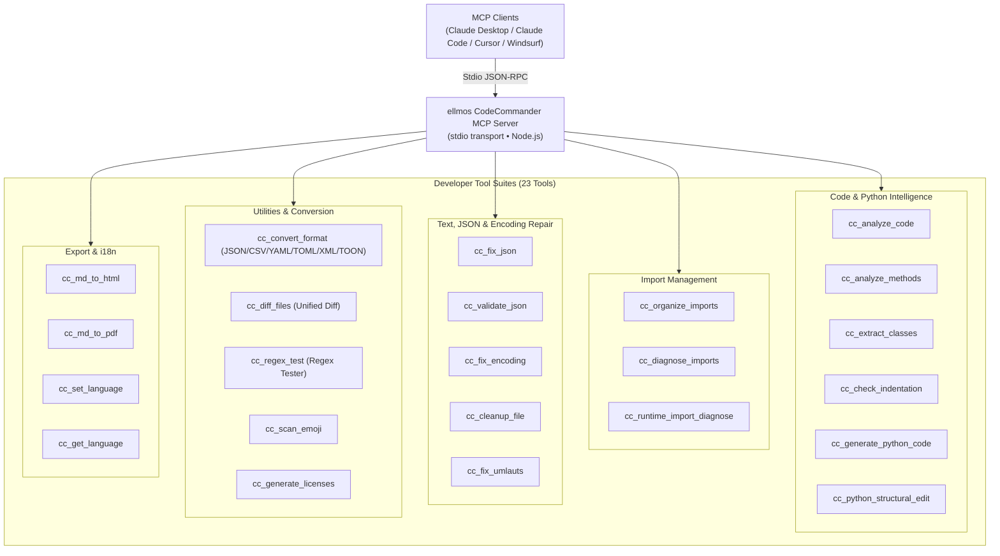
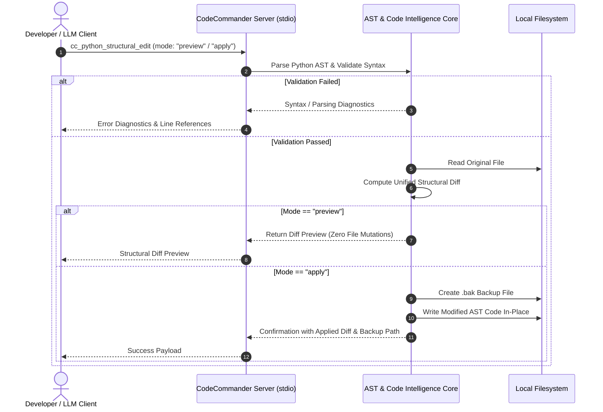

<p align="center">
  
</p>

# ellmos CodeCommander MCP Server

**🇩🇪 [Deutsche Version](README_de.md)**

*Part of the [ellmos-ai](https://github.com/ellmos-ai) family.*

[](https://opensource.org/licenses/MIT)
[](https://www.npmjs.com/package/ellmos-codecommander-mcp)
[](https://github.com/ellmos-ai/ellmos-codecommander-mcp/actions/workflows/tests.yml)
[](https://github.com/ellmos-ai/ellmos-codecommander-mcp)
[](https://nodejs.org/)
[](https://nodejs.org/)
[](SECURITY.md)
[](SECURITY.md)
[](SECURITY.md)
[](THIRD_PARTY_LICENSES.md)
[](MARKETING-LOG.txt)
[](https://github.com/ellmos-ai)
[](https://github.com/open-bricks)
[](llms.txt)

> [!NOTE]
> **For AI Assistants & LLMs:** Machine-readable indexing documentation for this repository is available at [`llms.txt`](llms.txt). The server exposes 23 specialized tools under the `cc_` prefix.

A developer-focused **Model Context Protocol (MCP) server** that gives AI assistants code analysis, structural Python editing, JSON repair, encoding fix, import organization, format conversion, file diff, and regex testing capabilities.

**23 tools** optimized for developers - the coding companion to [FileCommander](https://github.com/ellmos-ai/ellmos-filecommander-mcp).

**Discoverability:** Published on [npm](https://www.npmjs.com/package/ellmos-codecommander-mcp) as `ellmos-codecommander-mcp`, visible on [Glama](https://glama.ai/mcp/servers/b9kjs4uaav), and prepared for the official MCP Registry with [`server.json`](server.json) under `io.github.ellmos-ai/ellmos-codecommander-mcp`. Registry and directory manifests [`server.json`](server.json), [`glama.json`](glama.json), [`smithery.yaml`](smithery.yaml), and [`llms.txt`](llms.txt) are maintained in full parity.

---

## Quick Navigation

1. [Overview & Highlights](#1-overview--highlights)
2. [Architecture & System Overview](#2-architecture--system-overview)
3. [Safe Structural Edit Lifecycle](#3-safe-structural-edit-lifecycle)
4. [Governance & Runtime Invariants](#4-governance--runtime-invariants)
5. [Developer Tool Suite (23 Tools)](#5-developer-tool-suite-23-tools)
6. [Shared Tools with FileCommander](#6-shared-tools-with-filecommander)
7. [Installation & Quickstart](#7-installation--quickstart)
8. [Configuration & MCP Client Setup](#8-configuration--mcp-client-setup)
9. [Multi-Language Support (i18n)](#9-multi-language-support-i18n)
10. [Development & Quality Assurance](#10-development--quality-assurance)
11. [Sibling Ecosystem & Partner Matrix](#11-sibling-ecosystem--partner-matrix)
12. [Third-Party Licenses & Transparency](#12-third-party-licenses--transparency)
13. [Security Policy & Response SLA](#13-security-policy--response-sla)
14. [Changelog & Version History](#14-changelog--version-history)
15. [License & Liability Notice](#15-license--liability-notice)

---

## 1. Overview & Highlights

While FileCommander handles filesystem operations and system processes, CodeCommander focuses specifically on **code intelligence and developer precision**:

- **Python, JavaScript & TypeScript Analysis** — Extension-dispatched classes, methods, functions, complexity metrics, and import analysis; JS/TS analysis is regex-based and read-only.
- **BACH-derived Python Helpers** — Runtime import diagnostics, structural edits, indentation checks, and template-based code generation.
- **Explicit Language Gates** — Python-only path tools reject non-`.py` files explicitly instead of producing Python-shaped false findings.
- **JSON Repair & Validation** — Automatically repair broken JSON (trailing commas, single quotes, BOM, comments) with precise error locations.
- **PEP 8 Import Organization** — Sort and deduplicate Python imports per PEP 8 guidelines.
- **Encoding & Mojibake Repair** — Fix Mojibake and double-encoded UTF-8 (27+ patterns) and broken German characters (70+ umlaut patterns).
- **Universal Format Conversion** — Convert between JSON, CSV, INI, YAML, TOML, XML, and TOON formats losslessly.
- **Unified File Diff** — Compare two files with LCS unified diff output and configurable context lines.
- **Regex Testing Workbench** — Test regular expressions with match details, capturing groups, and replace previews.
- **Markdown Export** — Convert Markdown to standalone HTML or PDF with syntax-styled code blocks, tables, and blockquotes.
- **Cross-Platform Native** — Full support on Windows, macOS, and Linux.

---

## 2. Architecture & System Overview



---

## 3. Safe Structural Edit Lifecycle



---

## 4. Governance & Runtime Invariants

`ellmos-codecommander-mcp` guarantees 10 core architectural and runtime invariants across all platforms:

| Invariant ID | Classification | Architectural Guarantee & Verification Mechanism |
| :--- | :--- | :--- |
| `INV-LOCAL-01` | Zero-Egress Privacy | Pure local stdio JSON-RPC transport; zero network telemetry, cloud beacons, or remote egress. |
| `INV-SEC-02` | Unprivileged Security | Standard user-space execution (`RunAsInvoker`) requiring zero root or administrative elevation. |
| `INV-PREV-03` | Preview Safety | Structural edits default to non-mutating preview mode (`mode: "preview"`) with unified diff generation. |
| `INV-BAK-04` | Automatic Backups | File modifications automatically generate timestamped `.bak` files before in-place disk writes. |
| `INV-ISOL-05` | Subprocess Isolation | Python runtime import diagnosis executes in isolated, timeout-bounded child processes. |
| `INV-GATE-06` | Explicit Language Gates | Python-specific path tools reject non-`.py` files explicitly; JS/TS analysis is read-only and regex-based. |
| `INV-ENC-07` | Non-Destructive Encoding | Repaired text restores 27+ Mojibake and 70+ German umlaut patterns without loss or binary corruption. |
| `INV-FMT-08` | Format Interchange Parity | Lossless format conversions across JSON, CSV, INI, YAML, TOML, XML, and TOON with schema preservation. |
| `INV-I18N-09` | Runtime Multi-Language | Dynamic runtime language switching across 6 languages (EN, DE, ES, ZH, JA, RU) via `cc_set_language`. |
| `INV-SLA-10` | 48h Security Response SLA | Verified across Ubuntu, Windows, macOS on Node 20, 22, 24 with public 48h response / 5-day triage commitment. |

---

## 5. Developer Tool Suite (23 Tools)

### Code Analysis (3 tools)

| Tool | Description |
|------|-------------|
| `cc_analyze_code` | Read-only Python or regex-based JavaScript/TypeScript analysis: classes, functions, imports, LOC, complexity |
| `cc_analyze_methods` | Read-only Python or regex-based JavaScript/TypeScript method analysis; Python retains its BACH guardrails |
| `cc_extract_classes` | Extract Python classes/functions as separate text blocks, optionally including pycutter-style inline content |

### Import Management (3 tools)

| Tool | Description |
|------|-------------|
| `cc_organize_imports` | Sort & deduplicate Python imports per PEP 8 |
| `cc_diagnose_imports` | Read-only Python or regex-based JavaScript/TypeScript import diagnostics |
| `cc_runtime_import_diagnose` | Run isolated Python runtime imports with timeouts, `__init__.py` analysis, and circular-import hints |

### JSON Tools (2 tools)

| Tool | Description |
|------|-------------|
| `cc_fix_json` | Repair broken JSON (BOM, trailing commas, comments, single quotes) |
| `cc_validate_json` | Validate JSON with detailed error position and context |

### Encoding & Text (3 tools)

| Tool | Description |
|------|-------------|
| `cc_fix_encoding` | Fix Mojibake / double-encoded UTF-8 (27+ patterns) |
| `cc_cleanup_file` | Remove BOM, NUL bytes, trailing whitespace, normalize line endings |
| `cc_fix_umlauts` | Repair broken German umlauts (70+ patterns, HTML entities, escapes) |

### Scanning (1 tool)

| Tool | Description |
|------|-------------|
| `cc_scan_emoji` | Scan files for emojis with codepoint info |

### Format & Documentation (2 tools)

| Tool | Description |
|------|-------------|
| `cc_convert_format` | Convert between JSON, CSV, INI, YAML, TOML, XML, and TOON formats |
| `cc_generate_licenses` | Generate third-party license file (npm/pip) |

### Developer Utilities (2 tools)

| Tool | Description |
|------|-------------|
| `cc_diff_files` | Compare two files with unified diff output (configurable context lines) |
| `cc_regex_test` | Test regex patterns against text/files with match details, groups, and replace preview |

### Python Assistance (3 tools)

| Tool | Description |
|------|-------------|
| `cc_check_indentation` | Detect missing colons, unindented return/yield statements, and mixed tab/space indentation |
| `cc_generate_python_code` | Generate Python functions, classes, dataclasses, CLI stubs, tests, exceptions, and modules from templates |
| `cc_python_structural_edit` | Inspect and apply structural Python edits with preview, test-file, syntax-check and backup modes |

### Export (2 tools)

| Tool | Description |
|------|-------------|
| `cc_md_to_html` | Markdown to standalone HTML with CSS styling (headers, code blocks, tables, nested lists, blockquotes, images, checkboxes) |
| `cc_md_to_pdf` | Markdown to PDF via headless browser (Edge/Chrome). Falls back to HTML if no browser is available |

### Runtime Language Management (2 tools)

| Tool | Description |
|------|-------------|
| `cc_set_language` | Switch active runtime language (`en`, `de`, `es`, `zh`, `ja`, `ru`) |
| `cc_get_language` | Query currently active language and supported locale codes |

**Total: 23 developer tools** available under the `cc_` prefix.

---

## 6. Shared Tools with FileCommander

7 tools exist in both FileCommander and CodeCommander for convenience:

| FileCommander | CodeCommander | Function |
|---------------|---------------|----------|
| `fc_fix_json` | `cc_fix_json` | JSON repair |
| `fc_validate_json` | `cc_validate_json` | JSON validation |
| `fc_fix_encoding` | `cc_fix_encoding` | Encoding repair |
| `fc_cleanup_file` | `cc_cleanup_file` | File cleanup |
| `fc_convert_format` | `cc_convert_format` | Format conversion (JSON/CSV/INI/YAML/TOML/XML/TOON) |
| `fc_md_to_html` | `cc_md_to_html` | Markdown to HTML export |
| `fc_md_to_pdf` | `cc_md_to_pdf` | Markdown to PDF export |

All tools in CodeCommander use the `cc_` prefix to guarantee seamless coexistence with FileCommander's `fc_` namespace.

---

## 7. Installation & Quickstart

### Prerequisites

- [Node.js](https://nodejs.org/) 20 or higher
- npm 9 or higher

### Option 1: Install from NPM (Recommended)

```bash
npm install -g ellmos-codecommander-mcp
```

### Option 2: Install from Source

```bash
git clone https://github.com/ellmos-ai/ellmos-codecommander-mcp.git
cd ellmos-codecommander-mcp
npm install
npm run build
```

---

## 8. Configuration & MCP Client Setup

### Claude Desktop

Add to your `claude_desktop_config.json`:

- **Windows:** `%APPDATA%\Claude\claude_desktop_config.json`
- **macOS:** `~/Library/Application Support/Claude/claude_desktop_config.json`

#### Global NPM Install:

```json
{
  "mcpServers": {
    "codecommander": {
      "command": "ellmos-codecommander"
    }
  }
}
```

#### From Source Build:

```json
{
  "mcpServers": {
    "codecommander": {
      "command": "node",
      "args": ["/absolute/path/to/ellmos-codecommander-mcp/dist/index.js"]
    }
  }
}
```

### Coexistence with FileCommander

FileCommander and CodeCommander are designed to run concurrently:

```json
{
  "mcpServers": {
    "filecommander": {
      "command": "ellmos-filecommander"
    },
    "codecommander": {
      "command": "ellmos-codecommander"
    }
  }
}
```

---

## 9. Multi-Language Support (i18n)

CodeCommander natively supports 6 languages for all tool descriptions, output notices, and diagnostic messages:
- `en` — English (Default)
- `de` — Deutsch (German)
- `es` — Español (Spanish)
- `zh` — 简体中文 (Chinese Simplified)
- `ja` — 日本語 (Japanese)
- `ru` — Русский (Russian)

Use `cc_get_language` to check the current language or `cc_set_language` to dynamically change it during an active MCP session.

---

## 10. Development & Quality Assurance

```bash
npm install
npm run dev               # TypeScript watch mode
npm run build             # Compile TypeScript to dist/
npm start                 # Run built server via stdio
npm test                  # Run Vitest unit suite (196 tests)
npm run test:integration  # Real MCP stdio test suite (52 assertions, build first)
npm run test:i18n         # Translation parity test suite (43 assertions)
npm run test:all          # Run full QA pipeline (build + vitest + integration + i18n)
```

The test gates are deliberately separated and automated in CI across **Ubuntu**, **macOS**, and **Windows** on Node.js 20, 22, and 24 (totaling 292 automated assertions, 100% green).

---

## 11. Sibling Ecosystem & Partner Matrix

Part of the **[ellmos-ai](https://github.com/ellmos-ai)** and **[open-bricks](https://github.com/open-bricks)** family of local-first tools:

### MCP Server Family

| Server | Tools | Focus | npm |
|--------|-------|-------|-----|
| [FileCommander](https://github.com/ellmos-ai/ellmos-filecommander-mcp) | 50 | Filesystem, process management, interactive sessions, cloud-lock-safe operations | [`ellmos-filecommander-mcp`](https://www.npmjs.com/package/ellmos-filecommander-mcp) |
| **[CodeCommander](https://github.com/ellmos-ai/ellmos-codecommander-mcp)** | **23** | **Code analysis, AST edits, JSON repair, diff, regex** | **[`ellmos-codecommander-mcp`](https://www.npmjs.com/package/ellmos-codecommander-mcp)** |
| [Clatcher](https://github.com/ellmos-ai/ellmos-clatcher-mcp) | 12 | File repair, format conversion, batch operations | [`ellmos-clatcher-mcp`](https://www.npmjs.com/package/ellmos-clatcher-mcp) |
| [n8n Manager](https://github.com/ellmos-ai/n8n-manager-mcp) | 19 | n8n workflow management via AI assistants | [`n8n-manager-mcp`](https://www.npmjs.com/package/n8n-manager-mcp) |
| [ControlCenter](https://github.com/ellmos-ai/ellmos-controlcenter-mcp) | 34 | MCP stack discovery, profile management, control plane | [`ellmos-controlcenter-mcp`](https://www.npmjs.com/package/ellmos-controlcenter-mcp) |
| [Homebase](https://github.com/ellmos-ai/ellmos-homebase-mcp) | 51 | Local-first LLM memory, knowledge, state, routing, swarm orchestration | [`ellmos-homebase-mcp`](https://www.npmjs.com/package/ellmos-homebase-mcp) (alpha) |
| [ServerCommander](https://github.com/ellmos-ai/ellmos-servercommander-mcp) | 8 | Server operations: health checks, log analysis, deploy dry-runs, mail diagnostics | [`ellmos-servercommander-mcp`](https://www.npmjs.com/package/ellmos-servercommander-mcp) (alpha) |
| [Blender Use](https://github.com/ellmos-ai/ellmos-blender-use-mcp) | 4 | Headless Blender asset QA and FBX reimport verification | [`ellmos-blender-use-mcp`](https://www.npmjs.com/package/ellmos-blender-use-mcp) (alpha) |
| [Open Compute](https://github.com/ellmos-ai/open-compute-mcp) | 16 | Model-agnostic computer use: capture, safety-gated actions, Windows UIA | [`open-compute-mcp`](https://www.npmjs.com/package/open-compute-mcp) (alpha) |

### Sibling Developer, File & Document Tools

| Ecosystem | Tool / Project | Focus & Capabilities |
|---|---|---|
| **ellmos-ai** | [sqlite-transit-sync](https://github.com/ellmos-ai/sqlite-transit-sync) | Offline SQLite change distribution with HMAC verification |
| **ellmos-ai** | [policy-registry](https://github.com/ellmos-ai/policy-registry) | Cryptographically signed delegation policies for AI agents |
| **ellmos-ai** | [clutch](https://github.com/ellmos-ai/clutch) | Provider-neutral LLM orchestration with auto-routing and budget tracking |
| **ellmos-ai** | [BACH](https://github.com/ellmos-ai/bach) | Local-first text-based OS for LLM agents — 113+ handlers, 550+ tools |
| **dev-bricks** | [DevCenter](https://github.com/dev-bricks/DevCenter) | PySide6 Developer Desktop Suite & offline secret vault |
| **dev-bricks** | [CodeBox](https://github.com/dev-bricks/CodeBox) | Fast desktop code snippet manager & local AST indexing |
| **dev-bricks** | [MethodenAnalyser](https://github.com/dev-bricks/MethodenAnalyser) | Method flow & complexity diagnostic engine |
| **doc-bricks** | [PDFtoPDFocr](https://github.com/doc-bricks/PDFtoPDFocr) | Desktop OCR pipeline for searchable PDFs with Tesseract |
| **doc-bricks** | [DokuReader](https://github.com/doc-bricks/DokuReader) | Multi-format document workspace & offline PDF export |
| **file-bricks** | [ProFiler](https://github.com/file-bricks/ProFiler) | Multi-pane file management & bulk batch operations |
| **open-bricks** | [open-bricks](https://github.com/open-bricks) | Umbrella organization for AI-native desktop applications |

---

## 12. Third-Party Licenses & Transparency

This project strictly adheres to open-source transparency:
- All runtime and development dependencies are audited in [`THIRD_PARTY_LICENSES.md`](THIRD_PARTY_LICENSES.md).
- Distributed exclusively under permissive open-source licenses (**MIT**, **BSD-2-Clause**, **BSD-3-Clause**, **Apache-2.0**).
- Comprehensive discoverability, personas, and marketing metrics are documented in [`MARKETING-LOG.txt`](MARKETING-LOG.txt).
- Zero proprietary tracking, zero telemetric beacons, and zero viral copyleft dependencies.

---

## 13. Security Policy & Response SLA

Please review [SECURITY.md](SECURITY.md) for full vulnerability disclosure procedures.

- **Zero-Egress Guarantee:** Completely local execution over stdio.
- **Preview & Backup Safety:** Destructive operations create `.bak` backups and support non-mutating preview.
- **Unprivileged User Mode:** Runs under standard unprivileged user permissions (`RunAsInvoker`).
- **Dedicated Response Channels:** Contact `security@ellmos.ai` and `support@lukasgeiger.com` with a guaranteed **48-hour initial response SLA** and **5-day triage commitment**.

---

## 14. Changelog & Version History

See [CHANGELOG.md](CHANGELOG.md) for release notes and version history.

---

## 15. License & Liability Notice

This project is licensed under the [MIT License](LICENSE) — Copyright © 2026 Lukas Geiger ([ellmos-ai](https://github.com/ellmos-ai)).

Dieses Projekt ist eine **unentgeltliche Open-Source-Schenkung** im Sinne der §§ 516 ff. BGB. Die Haftung des Urhebers ist gemäß **§ 521 BGB** auf **Vorsatz und grobe Fahrlässigkeit** beschränkt. Ergänzend gilt der Haftungsausschluss der MIT-Lizenz. Nutzung auf eigenes Risiko. Keine Wartungszusage, keine Verfügbarkeitsgarantie, keine Gewähr für Fehlerfreiheit oder Eignung für einen bestimmten Zweck.

*This project is an unpaid open-source donation under German law. Liability is limited to intent and gross negligence (§ 521 German Civil Code), supplemented by the MIT License warranty disclaimer. Use at your own risk.*
