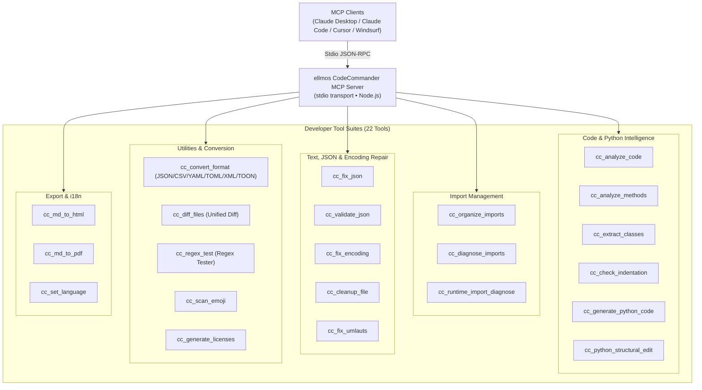

<p align="center">
  
</p>

# ellmos CodeCommander MCP Server
**🇩🇪 [Deutsche Version](README_de.md)**

*Part of the [ellmos-ai](https://github.com/ellmos-ai) family.*

[](https://opensource.org/licenses/MIT)
[](https://www.npmjs.com/package/ellmos-codecommander-mcp)
[](https://github.com/ellmos-ai/ellmos-codecommander-mcp/actions/workflows/tests.yml)
[](https://vitest.dev/)
[](https://nodejs.org/)
[](https://github.com/ellmos-ai)
[](https://github.com/open-bricks)
[](llms.txt)

> [!NOTE]
> **For AI Assistants & LLMs:** Machine-readable indexing documentation for this repository is available at [`llms.txt`](llms.txt). The server exposes 22 specialized tools under the `cc_` prefix.

A developer-focused **Model Context Protocol (MCP) server** that gives AI assistants code analysis, structural Python editing, JSON repair, encoding fix, import organization, format conversion, file diff, and regex testing capabilities.

**21 tools** (+1 i18n tool) optimized for developers - the coding companion to [FileCommander](https://github.com/ellmos-ai/ellmos-filecommander-mcp).

**Discoverability:** Published on [npm](https://www.npmjs.com/package/ellmos-codecommander-mcp) as `ellmos-codecommander-mcp`, visible on [Glama](https://glama.ai/mcp/servers/b9kjs4uaav), and prepared for the official MCP Registry with [`server.json`](server.json) under `io.github.ellmos-ai/ellmos-codecommander-mcp`.

---

## Architecture Overview



---

## Why CodeCommander?

While FileCommander handles filesystem operations, CodeCommander focuses on **code intelligence**:

- **Python Code Analysis** - AST-based class/method extraction, complexity metrics, import analysis
- **BACH-derived Python Helpers** - runtime import diagnostics, structural edits, indentation checks, and template-based code generation
- **JSON Repair** - Fix broken JSON automatically (trailing commas, single quotes, BOM, comments)
- **Import Organization** - Sort and deduplicate Python imports per PEP 8
- **Encoding Fix** - Repair Mojibake and double-encoded UTF-8 (27+ patterns)
- **Umlaut Repair** - Fix broken German characters (70+ patterns)
- **Format Conversion** - Convert between JSON, CSV, INI, YAML, TOML, XML, and TOON
- **File Diff** - Compare two files with unified diff output (LCS algorithm)
- **Regex Tester** - Test regular expressions with match details, groups, and replace preview
- **Markdown Export** - Convert Markdown to professional HTML/PDF with code blocks, tables, nested lists, blockquotes
- **Cross-platform** - Works on Windows, macOS, and Linux

---

## Installation

### Prerequisites

- [Node.js](https://nodejs.org/) 18 or higher

### Option 1: Install from NPM

```bash
npm install -g ellmos-codecommander-mcp
```

### Option 2: Install from Source

```bash
git clone https://github.com/ellmos-ai/ellmos-codecommander-mcp.git
cd ellmos-codecommander-mcp
npm install
npm run build
```

---

## Configuration

### Claude Desktop

Add to your `claude_desktop_config.json`:

**Windows:** `%APPDATA%\Claude\claude_desktop_config.json`
**macOS:** `~/Library/Application Support/Claude/claude_desktop_config.json`

#### If installed globally via NPM:

```json
{
  "mcpServers": {
    "codecommander": {
      "command": "ellmos-codecommander"
    }
  }
}
```

#### If installed from source:

```json
{
  "mcpServers": {
    "codecommander": {
      "command": "node",
      "args": ["/absolute/path/to/ellmos-codecommander-mcp/dist/index.js"]
    }
  }
}
```

### Using Both Servers Together

FileCommander and CodeCommander are designed to work side by side:

```json
{
  "mcpServers": {
    "filecommander": {
      "command": "ellmos-filecommander"
    },
    "codecommander": {
      "command": "ellmos-codecommander"
    }
  }
}
```

---

## Tools Overview

### Code Analysis (3 tools)

| Tool | Description |
|------|-------------|
| `cc_analyze_code` | Full code analysis: classes, functions, imports, LOC, complexity |
| `cc_analyze_methods` | Detailed method analysis: params, decorators, visibility, data flow, BACH guardrails |
| `cc_extract_classes` | Extract Python classes/functions as separate text blocks, optionally including pycutter-style inline content |

### Import Management (3 tools)

| Tool | Description |
|------|-------------|
| `cc_organize_imports` | Sort & deduplicate Python imports per PEP 8 |
| `cc_diagnose_imports` | Detect unused imports, duplicates, circular import risks |
| `cc_runtime_import_diagnose` | Run isolated Python runtime imports with timeouts, __init__.py analysis, and circular-import hints |

### JSON Tools (2 tools)

| Tool | Description |
|------|-------------|
| `cc_fix_json` | Repair broken JSON (BOM, trailing commas, comments, single quotes) |
| `cc_validate_json` | Validate JSON with detailed error position and context |

### Encoding & Text (3 tools)

| Tool | Description |
|------|-------------|
| `cc_fix_encoding` | Fix Mojibake / double-encoded UTF-8 (27+ patterns) |
| `cc_cleanup_file` | Remove BOM, NUL bytes, trailing whitespace, normalize line endings |
| `cc_fix_umlauts` | Repair broken German umlauts (70+ patterns, HTML entities, escapes) |

### Scanning (1 tool)

| Tool | Description |
|------|-------------|
| `cc_scan_emoji` | Scan files for emojis with codepoint info |

### Format & Documentation (2 tools)

| Tool | Description |
|------|-------------|
| `cc_convert_format` | Convert between JSON, CSV, INI, YAML, TOML, XML, and TOON formats |
| `cc_generate_licenses` | Generate third-party license file (npm/pip) |

### Developer Utilities (2 tools)

| Tool | Description |
|------|-------------|
| `cc_diff_files` | Compare two files with unified diff output (configurable context lines) |
| `cc_regex_test` | Test regex patterns against text/files with match details, groups, and replace preview |

### Python Assistance (3 tools)

| Tool | Description |
|------|-------------|
| `cc_check_indentation` | Detect missing colons, unindented return/yield statements, and mixed tab/space indentation |
| `cc_generate_python_code` | Generate Python functions, classes, dataclasses, CLI stubs, tests, exceptions, and modules from templates |
| `cc_python_structural_edit` | Inspect and apply structural Python edits with preview, test-file, syntax-check and backup modes |

### Export (2 tools)

| Tool | Description |
|------|-------------|
| `cc_md_to_html` | Markdown to standalone HTML with CSS styling (headers, code blocks, tables, nested lists, blockquotes, images, checkboxes) |
| `cc_md_to_pdf` | Markdown to PDF via headless browser (Edge/Chrome). Falls back to HTML if no browser is available |

**Total: 21 developer tools** (`cc_set_language` is also available for runtime language switching)

---

## Shared Tools

7 tools exist in both FileCommander and CodeCommander for convenience:

| FileCommander | CodeCommander | Function |
|---------------|---------------|----------|
| `fc_fix_json` | `cc_fix_json` | JSON repair |
| `fc_validate_json` | `cc_validate_json` | JSON validation |
| `fc_fix_encoding` | `cc_fix_encoding` | Encoding repair |
| `fc_cleanup_file` | `cc_cleanup_file` | File cleanup |
| `fc_convert_format` | `cc_convert_format` | Format conversion (JSON/CSV/INI/YAML/TOML/XML/TOON) |
| `fc_md_to_html` | `cc_md_to_html` | Markdown to HTML export |
| `fc_md_to_pdf` | `cc_md_to_pdf` | Markdown to PDF export |

---

## Tool Prefix

All tools use the `cc_` prefix (CodeCommander) to avoid conflicts with FileCommander's `fc_` prefix and other MCP servers.

---

## Security

See [SECURITY.md](SECURITY.md) for detailed security information.

Key points:
- File-modifying tools support preview/dry-run modes where applicable
- Backup creation is enabled by default for destructive operations
- No built-in sandboxing - security is delegated to the MCP client
- Designed for local development use via stdio transport

---

## Development

```bash
npm install
npm run dev    # Watch mode
npm run build  # One-time build
npm start      # Start server
npm test       # Run test suite (vitest)
```

### Testing

The project includes a comprehensive test suite covering all 21 developer tools and i18n behavior.

```bash
npm test              # Run all tests
npx vitest run        # Same as above
npx vitest --watch    # Watch mode
```

Tests are verified on **Windows**, **macOS**, and **Linux**.

GitHub Actions runs the build, Vitest suite, and npm package check on Node.js 20, 22, and 24.

---

## Changelog

See [CHANGELOG.md](CHANGELOG.md) for the full version history.

---

## License

[MIT](LICENSE) - Lukas Geiger ([ellmos-ai](https://github.com/ellmos-ai))

---

## History

This project was originally developed as **BACH CodeCommander** (`bach-codecommander-mcp`). It has been renamed to **ellmos CodeCommander** (`ellmos-codecommander-mcp`) as part of the [ellmos-ai](https://github.com/ellmos-ai) organization.

The legacy package name `bach-codecommander-mcp` is deprecated. Please use [`ellmos-codecommander-mcp`](https://www.npmjs.com/package/ellmos-codecommander-mcp) instead:

```bash
npm uninstall -g bach-codecommander-mcp
npm install -g ellmos-codecommander-mcp
```

---

## ellmos-ai Ecosystem

This MCP server is part of the **[ellmos-ai](https://github.com/ellmos-ai)** ecosystem — AI infrastructure, MCP servers, and intelligent tools.

### MCP Server Family

| Server | Tools | Focus | npm |
|--------|-------|-------|-----|
| [FileCommander](https://github.com/ellmos-ai/ellmos-filecommander-mcp) | 46 | Filesystem, process management, interactive sessions, cloud-lock-safe operations | [`ellmos-filecommander-mcp`](https://www.npmjs.com/package/ellmos-filecommander-mcp) |
| **[CodeCommander](https://github.com/ellmos-ai/ellmos-codecommander-mcp)** | **22** | **Code analysis, JSON repair, imports, diffs, regex** | **[`ellmos-codecommander-mcp`](https://www.npmjs.com/package/ellmos-codecommander-mcp)** |
| [Clatcher](https://github.com/ellmos-ai/ellmos-clatcher-mcp) | 12 | File repair, format conversion, batch operations | [`ellmos-clatcher-mcp`](https://www.npmjs.com/package/ellmos-clatcher-mcp) |
| [n8n Manager](https://github.com/ellmos-ai/n8n-manager-mcp) | 18 | n8n workflow management via AI assistants | [`n8n-manager-mcp`](https://www.npmjs.com/package/n8n-manager-mcp) |
| [ControlCenter](https://github.com/ellmos-ai/ellmos-controlcenter-mcp) | 20 | MCP stack discovery, profile management, control plane | [`ellmos-controlcenter-mcp`](https://www.npmjs.com/package/ellmos-controlcenter-mcp) |
| [Homebase](https://github.com/ellmos-ai/ellmos-homebase-mcp) | 45 | Local-first LLM memory, knowledge, state, routing, swarm orchestration | [`ellmos-homebase-mcp`](https://www.npmjs.com/package/ellmos-homebase-mcp) (alpha) |
| [ServerCommander](https://github.com/ellmos-ai/ellmos-servercommander-mcp) | 8 | Server operations: health checks, log analysis, deploy dry-runs, mail diagnostics | [`ellmos-servercommander-mcp`](https://www.npmjs.com/package/ellmos-servercommander-mcp) (alpha) |
| [Blender Use](https://github.com/ellmos-ai/ellmos-blender-use-mcp) | 3 | Headless Blender asset QA and FBX reimport verification | [`ellmos-blender-use-mcp`](https://www.npmjs.com/package/ellmos-blender-use-mcp) (alpha) |
| [Open Compute](https://github.com/ellmos-ai/open-compute-mcp) | 10 | Model-agnostic computer use: capture, safety-gated actions, Windows UIA | [`open-compute-mcp`](https://www.npmjs.com/package/open-compute-mcp) (alpha) |

### AI Infrastructure

| Project | Description |
|---------|-------------|
| [BACH](https://github.com/ellmos-ai/bach) | Local-first text-based OS for LLM agents — 113+ handlers, 550+ tools, SQLite memory |
| [open-compute](https://github.com/ellmos-ai/open-compute) | Model-agnostic computer-use core powering Open Compute MCP |
| [clutch](https://github.com/ellmos-ai/clutch) | Provider-neutral LLM orchestration with auto-routing and budget tracking |
| [rinnsal](https://github.com/ellmos-ai/rinnsal) | Lightweight agent memory, connectors, and automation infrastructure |
| [ellmos-stack](https://github.com/ellmos-ai/ellmos-stack) | Self-hosted AI research stack (Ollama + n8n + Rinnsal + KnowledgeDigest) |
| [MarbleRun](https://github.com/ellmos-ai/MarbleRun) | Autonomous agent chain framework for Claude Code |
| [gardener](https://github.com/ellmos-ai/gardener) | Minimalist database-driven LLM OS prototype (4 functions, 1 table) |
| [ellmos-tests](https://github.com/ellmos-ai/ellmos-tests) | Testing framework for LLM operating systems (7 dimensions) |

### Desktop Software

Our partner organization **[open-bricks](https://github.com/open-bricks)** bundles AI-native desktop applications — a modern, open-source software suite built for the age of AI. Categories include file management, document tools, developer utilities, and more.

## Liability

Dieses Projekt ist eine **unentgeltliche Open-Source-Schenkung** im Sinne der §§ 516 ff. BGB. Die Haftung des Urhebers ist gemäß **§ 521 BGB** auf **Vorsatz und grobe Fahrlässigkeit** beschränkt. Ergänzend gilt der Haftungsausschluss der MIT-Lizenz.

Nutzung auf eigenes Risiko. Keine Wartungszusage, keine Verfügbarkeitsgarantie, keine Gewähr für Fehlerfreiheit oder Eignung für einen bestimmten Zweck.

This project is an unpaid open-source donation under German law. Liability is limited to intent and gross negligence (§ 521 German Civil Code), supplemented by the MIT License warranty disclaimer. Use at your own risk.
