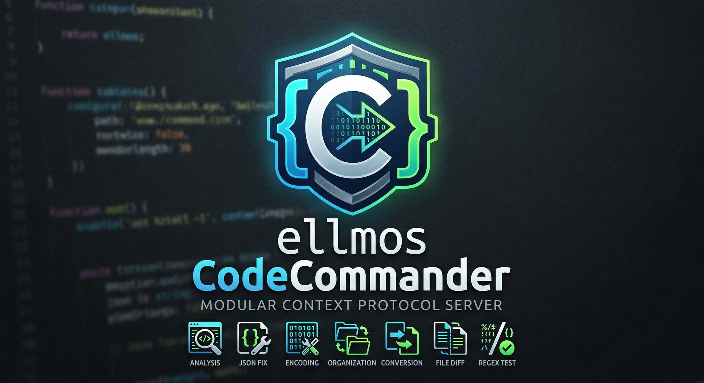

<p align="center">
  
</p>

# ellmos CodeCommander MCP Server

**🇬🇧 [English Version](README.md)**

*Teil der [ellmos-ai](https://github.com/ellmos-ai) Familie.*

[](https://opensource.org/licenses/MIT)
[](https://www.npmjs.com/package/ellmos-codecommander-mcp)
[](https://nodejs.org/)

Ein entwicklerfokussierter **Model Context Protocol (MCP) Server**, der KI-Assistenten Fähigkeiten für Code-Analyse, JSON-Reparatur, Encoding-Korrektur, Import-Organisation, Formatkonvertierung, Datei-Vergleich und Regex-Tests verleiht.

**17 Tools** optimiert für Entwickler – das Coding-Gegenstück zu [FileCommander](https://github.com/ellmos-ai/ellmos-filecommander-mcp).

---

## Warum CodeCommander?

Während FileCommander Dateisystem-Operationen übernimmt, konzentriert sich CodeCommander auf **Code-Intelligenz**:

- **Python Code-Analyse** – AST-basierte Klassen-/Methodenextraktion, Komplexitätsmetriken, Import-Analyse
- **JSON-Reparatur** – Automatische Korrektur von fehlerhaftem JSON (Trailing Commas, einfache Anführungszeichen, BOM, Kommentare)
- **Import-Organisation** – Python-Imports sortieren und deduplizieren gemäß PEP 8
- **Encoding-Korrektur** – Reparatur von Mojibake und doppelt kodiertem UTF-8 (27+ Muster)
- **Umlaut-Reparatur** – Korrektur defekter deutscher Umlaute (70+ Muster)
- **Formatkonvertierung** – Konvertierung zwischen JSON, CSV, INI, YAML, TOML, XML und TOON
- **Datei-Vergleich** – Zwei Dateien vergleichen mit Unified-Diff-Ausgabe (LCS-Algorithmus)
- **Regex-Tester** – Reguläre Ausdrücke testen mit Match-Details, Gruppen und Ersetzungsvorschau
- **Markdown-Export** – Markdown zu professionellem HTML/PDF konvertieren mit Code-Blöcken, Tabellen, verschachtelten Listen, Zitaten
- **Plattformübergreifend** – Funktioniert unter Windows, macOS und Linux

---

## Installation

### Voraussetzungen

- [Node.js](https://nodejs.org/) 18 oder höher

### Option 1: Installation über NPM

```bash
npm install -g ellmos-codecommander-mcp
```

### Option 2: Installation aus dem Quellcode

```bash
git clone https://github.com/ellmos-ai/ellmos-codecommander-mcp.git
cd ellmos-codecommander-mcp
npm install
npm run build
```

---

## Konfiguration

### Claude Desktop

Zur `claude_desktop_config.json` hinzufügen:

**Windows:** `%APPDATA%\Claude\claude_desktop_config.json`
**macOS:** `~/Library/Application Support/Claude/claude_desktop_config.json`

#### Bei globaler Installation über NPM:

```json
{
  "mcpServers": {
    "codecommander": {
      "command": "ellmos-codecommander"
    }
  }
}
```

#### Bei Installation aus dem Quellcode:

```json
{
  "mcpServers": {
    "codecommander": {
      "command": "node",
      "args": ["/absoluter/pfad/zu/ellmos-codecommander-mcp/dist/index.js"]
    }
  }
}
```

### Beide Server zusammen nutzen

FileCommander und CodeCommander sind für den parallelen Einsatz konzipiert:

```json
{
  "mcpServers": {
    "filecommander": {
      "command": "ellmos-filecommander"
    },
    "codecommander": {
      "command": "ellmos-codecommander"
    }
  }
}
```

---

## Tool-Übersicht

### Code-Analyse (3 Tools)

| Tool | Beschreibung |
|------|-------------|
| `cc_analyze_code` | Vollständige Code-Analyse: Klassen, Funktionen, Imports, LOC, Komplexität |
| `cc_analyze_methods` | Detaillierte Methodenanalyse: Parameter, Decorators, Sichtbarkeit, Datenfluss |
| `cc_extract_classes` | Python-Klassen/-Funktionen als separate Textblöcke extrahieren |

### Import-Verwaltung (2 Tools)

| Tool | Beschreibung |
|------|-------------|
| `cc_organize_imports` | Python-Imports sortieren & deduplizieren gemäß PEP 8 |
| `cc_diagnose_imports` | Ungenutzte Imports, Duplikate und zirkuläre Import-Risiken erkennen |

### JSON-Tools (2 Tools)

| Tool | Beschreibung |
|------|-------------|
| `cc_fix_json` | Fehlerhaftes JSON reparieren (BOM, Trailing Commas, Kommentare, einfache Anführungszeichen) |
| `cc_validate_json` | JSON validieren mit detaillierter Fehlerposition und Kontext |

### Encoding & Text (3 Tools)

| Tool | Beschreibung |
|------|-------------|
| `cc_fix_encoding` | Mojibake / doppelt kodiertes UTF-8 reparieren (27+ Muster) |
| `cc_cleanup_file` | BOM, NUL-Bytes, nachgestellte Leerzeichen entfernen, Zeilenenden normalisieren |
| `cc_fix_umlauts` | Defekte deutsche Umlaute reparieren (70+ Muster, HTML-Entities, Escape-Sequenzen) |

### Scanning (1 Tool)

| Tool | Beschreibung |
|------|-------------|
| `cc_scan_emoji` | Dateien nach Emojis mit Codepoint-Informationen durchsuchen |

### Format & Dokumentation (2 Tools)

| Tool | Beschreibung |
|------|-------------|
| `cc_convert_format` | Konvertierung zwischen JSON, CSV, INI, YAML, TOML, XML und TOON |
| `cc_generate_licenses` | Drittanbieter-Lizenzdatei generieren (npm/pip) |

### Entwickler-Werkzeuge (2 Tools)

| Tool | Beschreibung |
|------|-------------|
| `cc_diff_files` | Zwei Dateien vergleichen mit Unified-Diff-Ausgabe (konfigurierbare Kontextzeilen) |
| `cc_regex_test` | Regex-Muster gegen Text/Dateien testen mit Match-Details, Gruppen und Ersetzungsvorschau |

### Export (2 Tools)

| Tool | Beschreibung |
|------|-------------|
| `cc_md_to_html` | Markdown zu eigenständigem HTML mit CSS-Styling (Überschriften, Code-Blöcke, Tabellen, verschachtelte Listen, Zitate, Bilder, Checkboxen) |
| `cc_md_to_pdf` | Markdown zu PDF über Headless-Browser (Edge/Chrome). Fallback auf HTML wenn kein Browser verfügbar |

**Gesamt: 17 Tools**

---

## Gemeinsame Tools

7 Tools existieren sowohl in FileCommander als auch in CodeCommander zur einfacheren Nutzung:

| FileCommander | CodeCommander | Funktion |
|---------------|---------------|----------|
| `fc_fix_json` | `cc_fix_json` | JSON-Reparatur |
| `fc_validate_json` | `cc_validate_json` | JSON-Validierung |
| `fc_fix_encoding` | `cc_fix_encoding` | Encoding-Reparatur |
| `fc_cleanup_file` | `cc_cleanup_file` | Datei-Bereinigung |
| `fc_convert_format` | `cc_convert_format` | Formatkonvertierung (JSON/CSV/INI/YAML/TOML/XML/TOON) |
| `fc_md_to_html` | `cc_md_to_html` | Markdown zu HTML Export |
| `fc_md_to_pdf` | `cc_md_to_pdf` | Markdown zu PDF Export |

---

## Tool-Präfix

Alle Tools verwenden das Präfix `cc_` (CodeCommander), um Konflikte mit dem `fc_`-Präfix von FileCommander und anderen MCP-Servern zu vermeiden.

---

## Sicherheit

Siehe [SECURITY.md](SECURITY.md) für detaillierte Sicherheitsinformationen.

Wichtige Punkte:
- Alle dateiverändernden Tools unterstützen den `dry_run`-Modus
- Backup-Erstellung ist standardmäßig bei destruktiven Operationen aktiviert
- Kein integriertes Sandboxing – die Sicherheit wird an den MCP-Client delegiert
- Konzipiert für die lokale Entwicklungsnutzung über stdio-Transport

---

## Entwicklung

```bash
npm install
npm run dev    # Watch-Modus
npm run build  # Einmaliger Build
npm start      # Server starten
```

---

## Änderungsprotokoll

Siehe [CHANGELOG.md](CHANGELOG.md) für die vollständige Versionshistorie.

---

## Lizenz

[MIT](LICENSE) - Lukas Geiger ([ellmos-ai](https://github.com/ellmos-ai))

---

## Geschichte

Dieses Projekt wurde ursprünglich als **BACH CodeCommander** (`bach-codecommander-mcp`) entwickelt. Es wurde im Rahmen der [ellmos-ai](https://github.com/ellmos-ai) Organisation zu **ellmos CodeCommander** (`ellmos-codecommander-mcp`) umbenannt.

Das alte npm-Paket [`bach-codecommander-mcp`](https://www.npmjs.com/package/bach-codecommander-mcp) ist veraltet. Bitte verwenden Sie stattdessen [`ellmos-codecommander-mcp`](https://www.npmjs.com/package/ellmos-codecommander-mcp):

```bash
npm uninstall -g bach-codecommander-mcp
npm install -g ellmos-codecommander-mcp
```

---

## ellmos-ai Ecosystem

This MCP server is part of the **[ellmos-ai](https://github.com/ellmos-ai)** ecosystem — AI infrastructure, MCP servers, and intelligent tools.

### MCP Server Family

| Server | Tools | Focus | npm |
|--------|-------|-------|-----|
| [FileCommander](https://github.com/ellmos-ai/ellmos-filecommander-mcp) | 43 | Filesystem, process management, interactive sessions | `ellmos-filecommander-mcp` |
| **[CodeCommander](https://github.com/ellmos-ai/ellmos-codecommander-mcp)** | **17** | **Code analysis, AST parsing, import management** | `ellmos-codecommander-mcp` |
| [Clatcher](https://github.com/ellmos-ai/ellmos-clatcher-mcp) | 12 | File repair, format conversion, batch operations | `ellmos-clatcher-mcp` |
| [n8n Manager](https://github.com/ellmos-ai/n8n-manager-mcp) | 13 | n8n workflow management via AI assistants | `n8n-manager-mcp` |

### AI Infrastructure

| Project | Description |
|---------|-------------|
| [BACH](https://github.com/ellmos-ai/bach) | Text-based OS for LLMs — 109+ handlers, 373+ tools, 932+ skills |
| [clutch](https://github.com/ellmos-ai/clutch) | Provider-neutral LLM orchestration with auto-routing and budget tracking |
| [rinnsal](https://github.com/ellmos-ai/rinnsal) | Lightweight agent memory, connectors, and automation infrastructure |
| [ellmos-stack](https://github.com/ellmos-ai/ellmos-stack) | Self-hosted AI research stack (Ollama + n8n + Rinnsal + KnowledgeDigest) |
| [MarbleRun](https://github.com/ellmos-ai/MarbleRun) | Autonomous agent chain framework for Claude Code |
| [gardener](https://github.com/ellmos-ai/gardener) | Minimalist database-driven LLM OS prototype (4 functions, 1 table) |
| [ellmos-tests](https://github.com/ellmos-ai/ellmos-tests) | Testing framework for LLM operating systems (7 dimensions) |

### Desktop Software

Our partner organization **[open-bricks](https://github.com/open-bricks)** bundles AI-native desktop applications — a modern, open-source software suite built for the age of AI. Categories include file management, document tools, developer utilities, and more.
