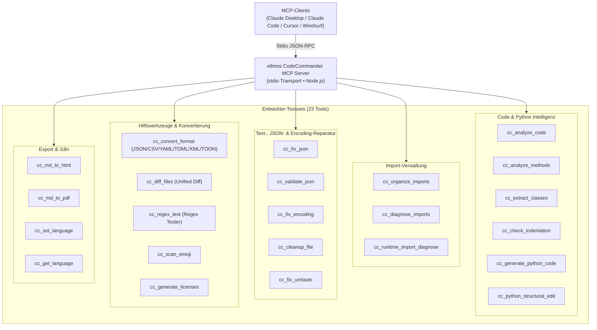
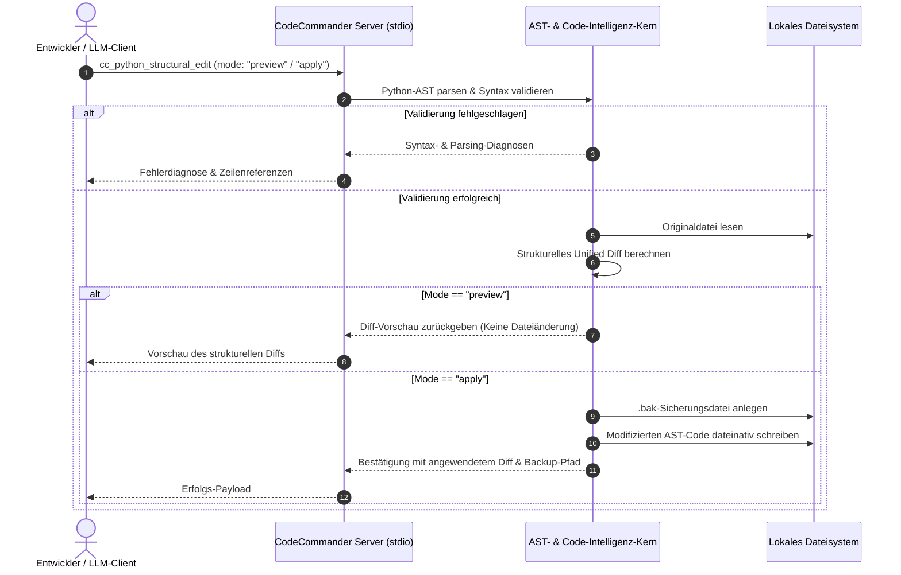

<p align="center">
  
</p>

# ellmos CodeCommander MCP Server

**🇬🇧 [English Version](README.md)**

*Teil der [ellmos-ai](https://github.com/ellmos-ai) Familie.*

[](https://opensource.org/licenses/MIT)
[](https://www.npmjs.com/package/ellmos-codecommander-mcp)
[](https://github.com/ellmos-ai/ellmos-codecommander-mcp/actions/workflows/tests.yml)
[](https://github.com/ellmos-ai/ellmos-codecommander-mcp)
[](https://nodejs.org/)
[](https://nodejs.org/)
[](SECURITY.md)
[](SECURITY.md)
[](SECURITY.md)
[](THIRD_PARTY_LICENSES.md)
[](MARKETING-LOG.txt)
[](https://github.com/ellmos-ai)
[](https://github.com/open-bricks)
[](llms.txt)

> [!NOTE]
> **Für KI-Assistenten & LLMs:** Die maschinenlesbare Index-Dokumentation für dieses Repository befindet sich in [`llms.txt`](llms.txt). Der Server stellt 23 spezialisierte Werkzeuge unter dem `cc_`-Präfix bereit.

Ein entwicklerfokussierter **Model Context Protocol (MCP) Server**, der KI-Assistenten Fähigkeiten für Code-Analyse, strukturelles Python-Editing, JSON-Reparatur, Encoding-Korrektur, Import-Organisation, Formatkonvertierung, Datei-Vergleich und Regex-Tests verleiht.

**23 Tools** optimiert für Entwickler – das Coding-Gegenstück zu [FileCommander](https://github.com/ellmos-ai/ellmos-filecommander-mcp).

**Auffindbarkeit:** Veröffentlicht auf [npm](https://www.npmjs.com/package/ellmos-codecommander-mcp) als `ellmos-codecommander-mcp`, auf [Glama](https://glama.ai/mcp/servers/b9kjs4uaav) sichtbar und mit [`server.json`](server.json) für die offizielle MCP Registry unter `io.github.ellmos-ai/ellmos-codecommander-mcp` vorbereitet. Die Registry- und Verzeichnismanifeste [`server.json`](server.json), [`glama.json`](glama.json), [`smithery.yaml`](smithery.yaml) und [`llms.txt`](llms.txt) werden in 100%iger Parität gepflegt.

---

## Schnellnavigation

1. [Übersicht & Highlights](#1-übersicht--highlights)
2. [Zielgruppen & Auffindbarkeit](#2-zielgruppen--auffindbarkeit)
3. [Vergleichsmatrix gegenüber Alternativen](#3-vergleichsmatrix-gegenüber-alternativen)
4. [Architektur & Systemübersicht](#4-architektur--systemübersicht)
5. [Sicherer struktureller Edit-Lebenszyklus](#5-sicherer-struktureller-edit-lebenszyklus)
6. [Governance & Laufzeit-Invarianten](#6-governance--laufzeit-invarianten)
7. [Entwickler-Toolsuite (23 Tools)](#7-entwickler-toolsuite-23-tools)
8. [Geteilte Werkzeuge mit FileCommander](#8-geteilte-werkzeuge-mit-filecommander)
9. [Installation & Schnellstart](#9-installation--schnellstart)
10. [Konfiguration & MCP-Client-Einrichtung](#10-konfiguration--mcp-client-einrichtung)
11. [Mehrsprachigkeit & Lokalisierung (i18n)](#11-mehrsprachigkeit--lokalisierung-i18n)
12. [Entwicklung & Qualitätssicherung](#12-entwicklung--qualitätssicherung)
13. [Geschwister-Ökosystem & Partner-Matrix](#13-geschwister-ökosystem--partner-matrix)
14. [Drittanbieter-Lizenzen & Transparenz](#14-drittanbieter-lizenzen--transparenz)
15. [Sicherheitsrichtlinie & Reaktions-SLA](#15-sicherheitsrichtlinie--reaktions-sla)
16. [Änderungsprotokoll & Versionshistorie](#16-änderungsprotokoll--versionshistorie)
17. [Lizenz & Haftungsausschluss](#17-lizenz--haftungsausschluss)

---

## 1. Übersicht & Highlights

Während FileCommander Dateisystemoperationen und Systemprozesse abdeckt, konzentriert sich CodeCommander auf **Code-Intelligenz und Entwickler-Präzision**:

- **Python-, JavaScript- & TypeScript-Analyse** — Dateiendungs-gestützte Erkennung von Klassen, Methoden, Funktionen, Komplexitätsmetriken und Importen; JS/TS-Analyse ist rein lesend und regex-basiert.
- **BACH-abgeleitete Python-Helfer** — Laufzeit-Importdiagnose, strukturelle Edits, Einrückungsprüfungen und Vorlagen-basierte Code-Generierung.
- **Explizite Sprachschranken** — Python-spezifische Pfadwerkzeuge weisen Nicht-`.py`-Dateien explizit ab, um Fehlinterpretationen auszuschließen.
- **JSON-Reparatur & Validierung** — Automatische Korrektur beschädigter JSON-Dateien (Trailing Commas, Single Quotes, BOM, Kommentare) mit präzisen Fehlerpositionsangaben.
- **PEP 8 Import-Organisation** — Sortierung und Deduplizierung von Python-Importen gemäß PEP 8.
- **Encoding- & Mojibake-Reparatur** — Behebung von Mojibake und doppelt kodiertem UTF-8 (27+ Muster) sowie fehlerhaften deutschen Umlauten (70+ Muster).
- **Universelle Formatkonvertierung** — Verlustfreie Konvertierung zwischen JSON, CSV, INI, YAML, TOML, XML und TOON.
- **Unified Datei-Diff** — Vergleich zweier Dateien mit LCS-Unified-Diff-Ausgabe und konfigurierbaren Kontextzeilen.
- **Regex-Testwerkbank** — Testen regulärer Ausdrücke mit Trefferdetails, Erfassungsgruppen und Ersetzungsvorschau.
- **Markdown-Export** — Konvertierung von Markdown in eigenständiges HTML oder PDF mit Syntax-formatierten Codeblöcken, Tabellen und Blockzitaten.
- **Plattformübergreifend** — Vollständige native Unterstützung für Windows, macOS und Linux.

---

## 2. Zielgruppen & Auffindbarkeit <a id="zielgruppen--auffindbarkeit"></a>

CodeCommander MCP wurde gezielt entwickelt, um zentrale Engpässe moderner autonomer KI-Coding-Agenten, lokaler Multi-Agenten-Schwärme und sicherheitskonformer Entwickler-Umgebungen zu lösen:

### Zielgruppen & Stakeholder-Personas

- **`[PERSONA-1]` Autonome KI-Coding-Agenten & LLM-Pair-Programmer**
  - **Profil:** Agenten wie Claude Code, Antigravity, Codex, Cursor und Windsurf, die selbstständige Code-Refactorings, Bugfixes, Test-Reparaturen und Feature-Erweiterungen durchführen.
  - **Problem:** LLM-Codeausgaben leiden häufig unter halluzinierten Importen, fehlerhafter Einrückung in verschachtelten Python-Blöcken, Syntaxbeschädigungen bei naiven Chunk-Edits oder ungültigem JSON.
  - **Lösung:** Native AST-Extraktion (`cc_extract_classes`, `cc_analyze_methods`), vorschau-sichere strukturelle Edits mit Unified Diff (`cc_python_structural_edit`), automatische Einrückungsprüfung (`cc_check_indentation`) und deterministische JSON-Reparatur (`cc_fix_json`).

- **`[PERSONA-2]` Full-Stack- & Python/TypeScript-Software-Entwickler**
  - **Profil:** Entwickler polyglotter Microservices, CLI-Werkzeuge und Datenpipelines mit Bedarf an sprachübergreifender AST-Analyse und schnellen Konfigurationswechseln.
  - **Problem:** Mühsame manuelle Formatkonvertierungen (JSON ↔ YAML ↔ TOML ↔ TOON ↔ XML), zerschossene deutsche Umlaute oder Mojibake aus Altsystemen sowie zirkuläre Laufzeit-Importe.
  - **Lösung:** Universeller Formatkonverter (`cc_convert_format`), verlustfreie Encoding- und Umlaut-Reparatur (`cc_fix_encoding`, `cc_fix_umlauts`), isolierte Laufzeit-Importdiagnose (`cc_runtime_import_diagnose`) und interaktive Regex-Testwerkbank (`cc_regex_test`).

- **`[PERSONA-3]` Enterprise AI Safety, SecOps & Code-Governance-Beauftragte**
  - **Profil:** Sicherheitsprüfer, Compliance-Ingenieure und Enterprise-Architekten, die MCP-Toolchains für Entwickler-Workstations und CI/CD-Runner auditieren.
  - **Problem:** Risiko von Code-Abfluss über Cloud-Telemetrie, unkontrollierte Prozess-Privilegien oder zerstörerische Dateimodifikationen durch KI-Assistenten.
  - **Lösung:** 100% Zero-Egress lokaler stdio-Transport (`INV-LOCAL-01`), unprivilegierte Ausführung (`INV-SEC-02`), zwingende `.bak`-Backups vor Modifikationen (`INV-BAK-04`), Dry-Run-Vorschau-Sicherheit (`INV-PREV-03`) und isolierte Subprozess-Timeouts (`INV-ISOL-05`).

- **`[PERSONA-4]` Open-Source-Ökosystem-Architekten & MCP-Tool-Entwickler**
  - **Profil:** Maintainer, die MCP-Server über Glama, Smithery, npm und GitHub veröffentlichen und distribuieren.
  - **Problem:** Fragmentierte Verzeichnis-Manifeste, fehlende Drittanbieter-Lizenznachweise und mangelnder maschinenlesbarer Kontext für KI-Crawler.
  - **Lösung:** 100% Manifest-Parität über `package.json`, `server.json`, `glama.json`, `smithery.yaml` und `llms.txt`, abgesichert durch automatisierte Vertragstests und ein vollständiges Open-Source-Lizenzinventar (`THIRD_PARTY_LICENSES.md`).

### Suchbegriffe mit hoher Absicht (SEO & Auffindbarkeit)

- `mcp server code analyse entwickler tools`
- `model context protocol python ast tools`
- `python structural edit mcp`
- `claude code entwickler mcp server`
- `mcp server json reparatur encoding korrektur`
- `offline mcp entwickler werkzeuge`
- `mcp python runtime import diagnose`
- `format converter mcp json yaml toml toon`
- `claude desktop mcp python ast refactoring`
- `offline code intelligence mcp server`

---

## 3. Vergleichsmatrix gegenüber Alternativen <a id="vergleichsmatrix-gegenueber-alternativen"></a>

Die folgende Matrix vergleicht CodeCommander MCP mit alternativen Entwickler-Werkzeugen über 10 kritische Dimensionen:

| Dimension / Fähigkeit | Generischer Datei-MCP | Rohe Shell / Ad-Hoc-Skripte | Schwergewichtige Cloud-LLMOps | Traditionelle IDE-Plugins | ellmos CodeCommander MCP |
| :--- | :--- | :--- | :--- | :--- | :--- |
| **1. AST-Code-Intelligenz** | Keine (rohe Text-Leseoperationen) | Erfordert eigene Python-Skripte | Cloud-Parser erforderlich | Integriert (nur GUI) | **Natives AST & regex JS/TS (`cc_analyze_code`)** |
| **2. Sichere Edit-Vorschau** | Keine (blindes Überschreiben) | Hohes Risiko (`sed`/`awk`) | Abhängig von Cloud-Gateways | Interaktiver Dialog | **Vorschau-sichere Diffs (`mode: "preview"`)** |
| **3. Zwingende Pre-Mutation-Backups** | Keine | Manuelles Skripting | Keine | Lokale Historie (opak) | **Automatische `.bak`-Erstellung (`INV-BAK-04`)** |
| **4. Laufzeit-Importdiagnose** | Keine | Unsichere direkte Ausführung | Keine | Teilweise / nur statisch | **Isolierter Subprozess + Timeout (`INV-ISOL-05`)** |
| **5. Encoding- & Mojibake-Reparatur** | Keine | Fragile `iconv`-Aufrufe | Keine | Einfacher Encoding-Wechsel | **27+ Mojibake, 70+ Umlaute (`cc_fix_encoding`)** |
| **6. Universelle Formatkonvertierung** | Keine | Mehrere disparate CLI-Tools | SaaS-Konvertierungs-APIs | Multi-Plugin-Setup | **Verlustfreie 7 Formate (`JSON/YAML/TOML/XML/TOON`)** |
| **7. Diff-Engine & Regex-Werkbank** | Keine | Einfaches `diff`/`grep` | Keine | Nur GUI-Bedienfeld | **LCS-Unified-Diff & Regex mit Gruppen/Ersetzung** |
| **8. Local-First & Zero-Egress** | Host-abhängig | Lokal | Cloud-Egress / Telemetrie | Häufig Cloud-Verbindung | **100% Offline-Stdio-JSON-RPC (`INV-LOCAL-01`)** |
| **9. Mehrsprachigkeit (i18n)** | Nur Englisch | Keine | Nur Englisch | Sprachpakete | **Dynamisch 6 Sprachen (`cc_set_language`)** |
| **10. Registry- & Manifest-Parität** | Minimal | Keine | Proprietär | Marktplatz-spezifisch | **npm, Glama, Smithery, MCP Registry, `llms.txt`** |

---

## 4. Architektur & Systemübersicht


```mermaid
graph TD
    Client["MCP-Clients<br/>(Claude Desktop / Claude Code / Cursor / Windsurf)"]
    Server["ellmos CodeCommander MCP Server<br/>(stdio Transport • Node.js)"]

    subgraph Tools["Entwickler-Toolsets (23 Tools)"]
        subgraph CodeIntel["Code & Python Intelligenz"]
            C1["cc_analyze_code"]
            C2["cc_analyze_methods"]
            C3["cc_extract_classes"]
            C4["cc_check_indentation"]
            C5["cc_generate_python_code"]
            C6["cc_python_structural_edit"]
        end

        subgraph Imports["Import-Verwaltung"]
            I1["cc_organize_imports"]
            I2["cc_diagnose_imports"]
            I3["cc_runtime_import_diagnose"]
        end

        subgraph Repair["Text-, JSON- & Encoding-Reparatur"]
            R1["cc_fix_json"]
            R2["cc_validate_json"]
            R3["cc_fix_encoding"]
            R4["cc_cleanup_file"]
            R5["cc_fix_umlauts"]
        end

        subgraph Utility["Hilfswerkzeuge & Konvertierung"]
            U1["cc_convert_format (JSON/CSV/YAML/TOML/XML/TOON)"]
            U2["cc_diff_files (Unified Diff)"]
            U3["cc_regex_test (Regex Tester)"]
            U4["cc_scan_emoji"]
            U5["cc_generate_licenses"]
        end

        subgraph Export["Export & i18n"]
            E1["cc_md_to_html"]
            E2["cc_md_to_pdf"]
            E3["cc_set_language"]
            E4["cc_get_language"]
        end
    end

    Client -->|Stdio JSON-RPC| Server
    Server --> CodeIntel
    Server --> Imports
    Server --> Repair
    Server --> Utility
    Server --> Export
```

---

## 5. Sicherer struktureller Edit-Lebenszyklus


```mermaid
sequenceDiagram
    autonumber
    actor Developer as Entwickler / LLM-Client
    participant Stdio as CodeCommander Server (stdio)
    participant Core as AST- & Code-Intelligenz-Kern
    participant Disk as Lokales Dateisystem

    Developer->>Stdio: cc_python_structural_edit (mode: "preview" / "apply")
    Stdio->>Core: Python-AST parsen & Syntax validieren
    alt Validierung fehlgeschlagen
        Core-->>Stdio: Syntax- & Parsing-Diagnosen
        Stdio-->>Developer: Fehlerdiagnose & Zeilenreferenzen
    else Validierung erfolgreich
        Core->>Disk: Originaldatei lesen
        Core->>Core: Strukturelles Unified Diff berechnen
        alt Mode == "preview"
            Core-->>Stdio: Diff-Vorschau zurückgeben (Keine Dateiänderung)
            Stdio-->>Developer: Vorschau des strukturellen Diffs
        else Mode == "apply"
            Core->>Disk: .bak-Sicherungsdatei anlegen
            Core->>Disk: Modifizierten AST-Code dateinativ schreiben
            Core-->>Stdio: Bestätigung mit angewendetem Diff & Backup-Pfad
            Stdio-->>Developer: Erfolgs-Payload
        end
    end
```

---

## 6. Governance & Laufzeit-Invarianten

`ellmos-codecommander-mcp` garantiert 10 fundamentale architektonische und Laufzeit-Invarianten über alle Betriebssysteme hinweg:

| Invarianten-ID | Klassifizierung | Architektonische Garantie & Verifikationsmechanismus |
| :--- | :--- | :--- |
| `INV-LOCAL-01` | Zero-Egress Datenschutz | Reiner lokaler Stdio JSON-RPC-Transport; null Netzwerktelemetrie, Cloud-Beacons oder Remote-Egress. |
| `INV-SEC-02` | Unprivilegierte Sicherheit | Standardmäßige Benutzer-Ausführung (`RunAsInvoker`) ohne Anforderung von Root- oder Administratorrechten. |
| `INV-PREV-03` | Vorschau-Sicherheit | Strukturelle Edits laufen standardmäßig im nicht-mutierenden Vorschaumodus (`mode: "preview"`) mit Unified Diff. |
| `INV-BAK-04` | Automatische Backups | Dateiändernde Tools erzeugen vor dem Schreiben automatisch zeitgestempelte `.bak`-Sicherungskopien. |
| `INV-ISOL-05` | Subprozess-Isolation | Python-Laufzeit-Importdiagnosen laufen in isolierten Kindprozessen mit strikten Timeout-Grenzen. |
| `INV-GATE-06` | Explizite Sprachschranken | Python-Tools weisen Nicht-`.py`-Dateien explizit ab; JS/TS-Analyse ist rein lesend und regex-basiert. |
| `INV-ENC-07` | Zerstörungsfreie Zeichenreparatur | Textkorrektur repariert 27+ Mojibake- und 70+ Umlaut-Muster ohne Datenverlust oder Binärkorruption. |
| `INV-FMT-08` | Format-Interchange-Parität | Verlustfreie Formatkonvertierung zwischen JSON, CSV, INI, YAML, TOML, XML und TOON mit Schemabewahrung. |
| `INV-I18N-09` | Laufzeit-Mehrsprachigkeit | Dynamische Umschaltung über 6 Sprachen (EN, DE, ES, ZH, JA, RU) via `cc_set_language` und `cc_get_language`. |
| `INV-SLA-10` | 48h Sicherheits-SLA | Verifiziert über Ubuntu, Windows, macOS auf Node 20, 22, 24 mit öffentlicher 48h-Reaktions- / 5-Tage-Triage-Zusage. |

---

## 7. Entwickler-Toolsuite (23 Tools)

### Code-Analyse (3 Tools)

| Tool | Beschreibung |
|------|-------------|
| `cc_analyze_code` | Rein lesende Python- oder regex-basierte JavaScript/TypeScript-Analyse: Klassen, Funktionen, Importe, LOC, Komplexität |
| `cc_analyze_methods` | Rein lesende Python- oder regex-basierte JavaScript/TypeScript-Methodenanalyse; Python behält seine BACH-Guardrails |
| `cc_extract_classes` | Extraktion von Python-Klassen/Funktionen als getrennte Textblöcke, optional mit pycutter-artigem Inline-Inhalt |

### Import-Verwaltung (3 Tools)

| Tool | Beschreibung |
|------|-------------|
| `cc_organize_imports` | Sortierung & Deduplizierung von Python-Importen gemäß PEP 8 |
| `cc_diagnose_imports` | Rein lesende Python- oder regex-basierte JavaScript/TypeScript-Importdiagnostik |
| `cc_runtime_import_diagnose` | Isolierte Python-Laufzeit-Importe mit Timeouts, `__init__.py`-Analyse und Zirkulärimport-Hinweisen |

### JSON-Werkzeuge (2 Tools)

| Tool | Beschreibung |
|------|-------------|
| `cc_fix_json` | Reparatur beschädigter JSON-Dateien (BOM, Trailing Commas, Kommentare, Single Quotes) |
| `cc_validate_json` | Validierung von JSON mit detaillierter Fehlerposition und Kontext |

### Encoding & Text (3 Tools)

| Tool | Beschreibung |
|------|-------------|
| `cc_fix_encoding` | Behebung von Mojibake / doppelt kodiertem UTF-8 (27+ Muster) |
| `cc_cleanup_file` | Entfernung von BOM, NUL-Bytes, nachgestellten Leerzeichen, Zeilenenden normalisieren |
| `cc_fix_umlauts` | Reparatur fehlerhafter deutscher Umlaute (70+ Muster, HTML-Entities, Escape-Sequenzen) |

### Scanning (1 Tool)

| Tool | Beschreibung |
|------|-------------|
| `cc_scan_emoji` | Durchsuchen von Dateien nach Emojis mit Codepoint-Informationen |

### Format & Dokumentation (2 Tools)

| Tool | Beschreibung |
|------|-------------|
| `cc_convert_format` | Konvertierung zwischen JSON, CSV, INI, YAML, TOML, XML und TOON Formaten |
| `cc_generate_licenses` | Erstellung von Drittanbieter-Lizenzübersichten (npm/pip) |

### Entwickler-Hilfswerkzeuge (2 Tools)

| Tool | Beschreibung |
|------|-------------|
| `cc_diff_files` | Vergleich zweier Dateien mit Unified-Diff-Ausgabe (konfigurierbare Kontextzeilen) |
| `cc_regex_test` | Testen von Regex-Mustern gegen Texte/Dateien mit Trefferdetails, Gruppen und Ersetzungsvorschau |

### Python-Assistenten (3 Tools)

| Tool | Beschreibung |
|------|-------------|
| `cc_check_indentation` | Erkennung fehlender Doppelpunkte, unvollständiger return/yield-Einrückungen und Tab/Space-Mischung |
| `cc_generate_python_code` | Generierung von Python-Funktionen, Klassen, Dataclasses, CLI-Stubs, Tests und Modulen aus Vorlagen |
| `cc_python_structural_edit` | Inspektion und Anwendung struktureller Python-Edits mit Vorschau-, Test-, Syntax- und Backup-Modus |

### Export (2 Tools)

| Tool | Beschreibung |
|------|-------------|
| `cc_md_to_html` | Markdown zu eigenständigem HTML mit CSS-Styling (Header, Codeblöcke, Tabellen, Checkboxen) |
| `cc_md_to_pdf` | Markdown zu PDF via Headless-Browser (Edge/Chrome). Fällt auf HTML zurück, falls kein Browser verfügbar |

### Laufzeit-Sprachverwaltung (2 Tools)

| Tool | Beschreibung |
|------|-------------|
| `cc_set_language` | Aktive Sprache zur Laufzeit umschalten (`en`, `de`, `es`, `zh`, `ja`, `ru`) |
| `cc_get_language` | Aktuell gesetzte Sprache und unterstützte Sprachcodes abfragen |

**Gesamt: 23 Entwickler-Werkzeuge** unter dem `cc_`-Präfix verfügbar.

---

## 8. Geteilte Werkzeuge mit FileCommander

7 Werkzeuge sind zwecks maximalem Nutzungskomfort sowohl in FileCommander als auch in CodeCommander verfügbar:

| FileCommander | CodeCommander | Funktion |
|---------------|---------------|----------|
| `fc_fix_json` | `cc_fix_json` | JSON-Reparatur |
| `fc_validate_json` | `cc_validate_json` | JSON-Validierung |
| `fc_fix_encoding` | `cc_fix_encoding` | Encoding-Reparatur |
| `fc_cleanup_file` | `cc_cleanup_file` | Dateibereinigung |
| `fc_convert_format` | `cc_convert_format` | Formatkonvertierung (JSON/CSV/INI/YAML/TOML/XML/TOON) |
| `fc_md_to_html` | `cc_md_to_html` | Markdown-zu-HTML-Export |
| `fc_md_to_pdf` | `cc_md_to_pdf` | Markdown-zu-PDF-Export |

Alle Tools in CodeCommander nutzen das `cc_`-Präfix, um eine konfliktfreie Koexistenz mit dem `fc_`-Namensraum sicherzustellen.

---

## 9. Installation & Schnellstart

### Voraussetzungen

- [Node.js](https://nodejs.org/) 20 oder höher
- npm 9 oder höher

### Option 1: Installation über NPM (Empfohlen)

```bash
npm install -g ellmos-codecommander-mcp
```

### Option 2: Installation aus dem Quellcode

```bash
git clone https://github.com/ellmos-ai/ellmos-codecommander-mcp.git
cd ellmos-codecommander-mcp
npm install
npm run build
```

---

## 10. Konfiguration & MCP-Client-Einrichtung

### Claude Desktop

Konfiguration in der `claude_desktop_config.json` hinterlegen:

- **Windows:** `%APPDATA%\Claude\claude_desktop_config.json`
- **macOS:** `~/Library/Application Support/Claude/claude_desktop_config.json`

#### Globale NPM-Installation:

```json
{
  "mcpServers": {
    "codecommander": {
      "command": "ellmos-codecommander"
    }
  }
}
```

#### Lokale Quellcode-Installation:

```json
{
  "mcpServers": {
    "codecommander": {
      "command": "node",
      "args": ["/absoluter/pfad/zu/ellmos-codecommander-mcp/dist/index.js"]
    }
  }
}
```

### Koexistenz mit FileCommander

FileCommander und CodeCommander können problemlos gleichzeitig betrieben werden:

```json
{
  "mcpServers": {
    "filecommander": {
      "command": "ellmos-filecommander"
    },
    "codecommander": {
      "command": "ellmos-codecommander"
    }
  }
}
```

---

## 11. Mehrsprachigkeit & Lokalisierung (i18n)

CodeCommander unterstützt 6 Sprachen nativ für alle Toolbeschreibungen, Hinweistexte und Diagnosemeldungen:
- `en` — English (Standard)
- `de` — Deutsch
- `es` — Español (Spanisch)
- `zh` — 简体中文 (Chinesisch)
- `ja` — 日本語 (Japanisch)
- `ru` — Русский (Russisch)

Über `cc_get_language` kann die aktuelle Sprache abgefragt und via `cc_set_language` während einer aktiven Sitzung dynamisch umgeschaltet werden.

---

## 12. Entwicklung & Qualitätssicherung

```bash
npm install
npm run dev               # TypeScript Watch-Modus
npm run build             # TypeScript-Kompilierung nach dist/
npm start                 # Gebauten Server via stdio starten
npm test                  # Vitest Unit-Testsuite ausführen (201 Tests)
npm run test:integration  # Echte MCP-Stdio-Integrationstests (52 Assertions)
npm run test:i18n         # Lokalisierungs- & Übersetzungstests (43 Assertions)
npm run test:all          # Gesamte Testpipeline ausführen (Build + Vitest + Integration + i18n)
```

Die Test-Gates sind getrennt und laufen in der CI auf **Ubuntu**, **macOS** und **Windows** auf Node.js 20, 22 und 24 (insgesamt 296 automatisierte Test-Assertions, 100% grün).

---

## 13. Geschwister-Ökosystem & Partner-Matrix

Teil der Familie lokaler Open-Source-Tools von **[ellmos-ai](https://github.com/ellmos-ai)** und **[open-bricks](https://github.com/open-bricks)**:

### MCP Server Familie

| Server | Tools | Schwerpunkt | npm |
|--------|-------|-------------|-----|
| [FileCommander](https://github.com/ellmos-ai/ellmos-filecommander-mcp) | 50 | Dateisystem, Prozesse, interaktive Terminals, Cloud-Lock-Schutz | [`ellmos-filecommander-mcp`](https://www.npmjs.com/package/ellmos-filecommander-mcp) |
| **[CodeCommander](https://github.com/ellmos-ai/ellmos-codecommander-mcp)** | **23** | **Code-Analyse, AST-Edits, JSON-Reparatur, Diff, Regex** | **[`ellmos-codecommander-mcp`](https://www.npmjs.com/package/ellmos-codecommander-mcp)** |
| [Clatcher](https://github.com/ellmos-ai/ellmos-clatcher-mcp) | 12 | Dateireparatur, Formatkonvertierung, Duplikaterkennung | [`ellmos-clatcher-mcp`](https://www.npmjs.com/package/ellmos-clatcher-mcp) |
| [n8n Manager](https://github.com/ellmos-ai/n8n-manager-mcp) | 19 | n8n-Workflow-Management, Snapshot-Rollback, Knoten-Katalog | [`n8n-manager-mcp`](https://www.npmjs.com/package/n8n-manager-mcp) |
| [ControlCenter](https://github.com/ellmos-ai/ellmos-controlcenter-mcp) | 34 | MCP-Stack-Erkennung, Profil-Verwaltung, Steuerungsebene | [`ellmos-controlcenter-mcp`](https://www.npmjs.com/package/ellmos-controlcenter-mcp) |
| [Homebase](https://github.com/ellmos-ai/ellmos-homebase-mcp) | 51 | Lokales LLM-Gedächtnis, Wissensbasen, Status-Routing, Schwarm-Koordination | [`ellmos-homebase-mcp`](https://www.npmjs.com/package/ellmos-homebase-mcp) (alpha) |
| [ServerCommander](https://github.com/ellmos-ai/ellmos-servercommander-mcp) | 8 | Serverbetrieb, Health-Checks, Log-Analyse, Mail-Diagnostik | [`ellmos-servercommander-mcp`](https://www.npmjs.com/package/ellmos-servercommander-mcp) (alpha) |
| [Blender Use](https://github.com/ellmos-ai/ellmos-blender-use-mcp) | 4 | Headless Blender Asset-QA und FBX-Reimport-Verifikation | [`ellmos-blender-use-mcp`](https://www.npmjs.com/package/ellmos-blender-use-mcp) (alpha) |
| [Open Compute](https://github.com/ellmos-ai/open-compute-mcp) | 16 | Modell-agnostische Desktop-Computer-Nutzung, Windows UIA, Bildschirm-Capture | [`open-compute-mcp`](https://www.npmjs.com/package/open-compute-mcp) (alpha) |

### Geschwister Entwickler-, Datei- & Dokumenten-Werkzeuge

| Ökosystem | Werkzeug / Projekt | Schwerpunkt & Fähigkeiten |
|---|---|---|
| **ellmos-ai** | [sqlite-transit-sync](https://github.com/ellmos-ai/sqlite-transit-sync) | Offline SQLite-Änderungsverteilung mit HMAC-Verifikation |
| **ellmos-ai** | [policy-registry](https://github.com/ellmos-ai/policy-registry) | Kryptografisch signierte Richtlinien und Berechtigungsdelegationen |
| **ellmos-ai** | [clutch](https://github.com/ellmos-ai/clutch) | Provider-neutrale LLM-Orchestrierung mit Auto-Routing und Budget-Tracking |
| **ellmos-ai** | [BACH](https://github.com/ellmos-ai/bach) | Lokales textbasiertes Betriebssystem für LLMs — 113+ Handler, 550+ Tools |
| **dev-bricks** | [DevCenter](https://github.com/dev-bricks/DevCenter) | PySide6 Entwickler-Desktop-Suite & Offline-Geheimnistresor |
| **dev-bricks** | [CodeBox](https://github.com/dev-bricks/CodeBox) | Schneller Desktop-Snippet-Manager mit lokaler AST-Indizierung |
| **dev-bricks** | [MethodenAnalyser](https://github.com/dev-bricks/MethodenAnalyser) | Methoden-Ablauf- und Komplexitätsanalyse |
| **doc-bricks** | [PDFtoPDFocr](https://github.com/doc-bricks/PDFtoPDFocr) | Desktop-OCR-Pipeline für durchsuchbare PDFs mit Tesseract |
| **doc-bricks** | [DokuReader](https://github.com/doc-bricks/DokuReader) | Multi-Format Dokumenten-Arbeitsbereich & Offline-PDF-Export |
| **file-bricks** | [ProFiler](https://github.com/file-bricks/ProFiler) | Multi-Pane Dateimanager & Stapelverarbeitung |
| **open-bricks** | [open-bricks](https://github.com/open-bricks) | Dachorganisation für KI-native Desktop-Anwendungen |

---

## 14. Drittanbieter-Lizenzen & Transparenz <a id="drittanbieter-lizenzen--transparenz"></a>

Dieses Projekt befolgt strenge Open-Source-Transparenzstandards:
- Alle Laufzeit- und Entwicklungsabhängigkeiten sind in [`THIRD_PARTY_LICENSES.md`](THIRD_PARTY_LICENSES.md) auditiert.
- Der aktuelle Produktionsabhängigkeits-Audit (`npm audit --omit=dev --json`, geprüft am 20.09.2026) meldet 5 verwundbare Paketknoten (3 hoch, 2 mittel); die Behebung ist in TASKPLAN #2198 erfasst.
- Ausschließliche Verwendung permissiver Open-Source-Lizenzen (**MIT**, **BSD-2-Clause**, **BSD-3-Clause**, **Apache-2.0**).
- Vollständige Zielgruppenanalysen, Personas und Marketingmetriken sind in [`MARKETING-LOG.txt`](MARKETING-LOG.txt) hinterlegt.
- Null proprietäres Tracking, null Telemetrie-Beacons und null virale Copyleft-Abhängigkeiten.

---

## 15. Sicherheitsrichtlinie & Reaktions-SLA

Bitte beachten Sie [SECURITY.md](SECURITY.md) für detaillierte Hinweise zur Sicherheitsarchitektur und Meldung von Schwachstellen.

- **Zero-Egress-Garantie:** Vollständig lokale Ausführung über Stdio ohne Netzwerkanfragen.
- **Vorschau- & Backup-Sicherheit:** Destruktive Operationen legen `.bak`-Backups an und unterstützen Vorschau-Diffs.
- **Unprivilegierter Modus:** Ausführung im Standard-Benutzerkontext (`RunAsInvoker`).
- **Verbindliche Reaktionszeiten:** Meldungen an `security@ellmos.ai` und `support@lukasgeiger.com` mit **48-Stunden-Erstreaktions-SLA** und **5-Werktage-Triage-Zusage**.

---

## 16. Änderungsprotokoll & Versionshistorie

Siehe [CHANGELOG.md](CHANGELOG.md) für detaillierte Versionshinweise.

---

## 17. Lizenz & Haftungsausschluss

Lizenziert unter der [MIT-Lizenz](LICENSE) — Copyright © 2026 Lukas Geiger ([ellmos-ai](https://github.com/ellmos-ai)).

Dieses Projekt ist eine **unentgeltliche Open-Source-Schenkung** im Sinne der §§ 516 ff. BGB. Die Haftung des Urhebers ist gemäß **§ 521 BGB** auf **Vorsatz und grobe Fahrlässigkeit** beschränkt. Ergänzend gilt der Haftungsausschluss der MIT-Lizenz. Nutzung auf eigenes Risiko. Keine Wartungszusage, keine Verfügbarkeitsgarantie, keine Gewähr für Fehlerfreiheit oder Eignung für einen bestimmten Zweck.

*This project is an unpaid open-source donation under German law. Liability is limited to intent and gross negligence (§ 521 German Civil Code), supplemented by the MIT License warranty disclaimer. Use at your own risk.*
