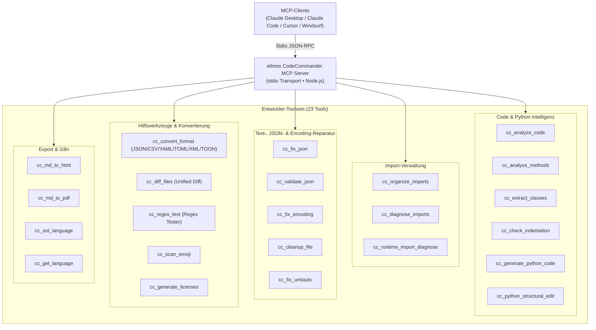
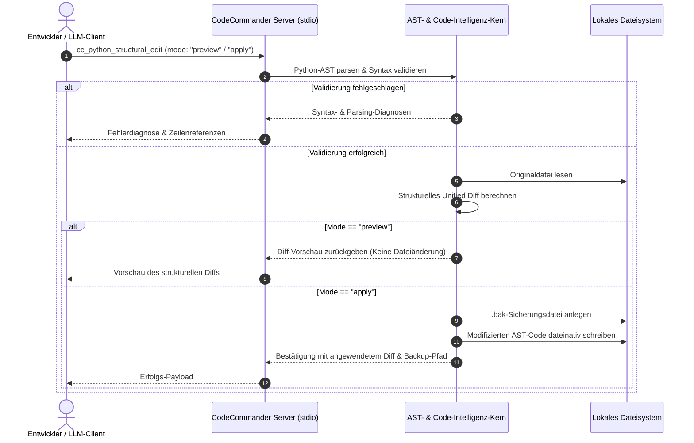

<p align="center">
  
</p>

# ellmos CodeCommander MCP Server

**🇬🇧 [English Version](README.md)**

*Teil der [ellmos-ai](https://github.com/ellmos-ai) Familie.*

[](https://opensource.org/licenses/MIT)
[](https://www.npmjs.com/package/ellmos-codecommander-mcp)
[](https://github.com/ellmos-ai/ellmos-codecommander-mcp/actions/workflows/tests.yml)
[](https://vitest.dev/)
[](https://nodejs.org/)
[](https://nodejs.org/)
[](SECURITY.md)
[](SECURITY.md)
[](https://github.com/ellmos-ai)
[](https://github.com/open-bricks)
[](llms.txt)

> [!NOTE]
> **Für KI-Assistenten & LLMs:** Die maschinenlesbare Index-Dokumentation für dieses Repository befindet sich in [`llms.txt`](llms.txt). Der Server stellt 23 spezialisierte Werkzeuge unter dem `cc_`-Präfix bereit.

Ein entwicklerfokussierter **Model Context Protocol (MCP) Server**, der KI-Assistenten Fähigkeiten für Code-Analyse, strukturelles Python-Editing, JSON-Reparatur, Encoding-Korrektur, Import-Organisation, Formatkonvertierung, Datei-Vergleich und Regex-Tests verleiht.

**23 Tools** optimiert für Entwickler – das Coding-Gegenstück zu [FileCommander](https://github.com/ellmos-ai/ellmos-filecommander-mcp).

**Auffindbarkeit:** Veröffentlicht auf [npm](https://www.npmjs.com/package/ellmos-codecommander-mcp) als `ellmos-codecommander-mcp`, auf [Glama](https://glama.ai/mcp/servers/b9kjs4uaav) sichtbar und mit [`server.json`](server.json) für die offizielle MCP Registry unter `io.github.ellmos-ai/ellmos-codecommander-mcp` vorbereitet. Die Registry- und Verzeichnismanifeste [`server.json`](server.json), [`glama.json`](glama.json), [`smithery.yaml`](smithery.yaml) und [`llms.txt`](llms.txt) werden in 100%iger Parität gepflegt.

---

## Architektur-Übersicht


```mermaid
graph TD
    Client["MCP-Clients<br/>(Claude Desktop / Claude Code / Cursor / Windsurf)"]
    Server["ellmos CodeCommander MCP Server<br/>(stdio Transport • Node.js)"]

    subgraph Tools["Entwickler-Toolsets (23 Tools)"]
        subgraph CodeIntel["Code & Python Intelligenz"]
            C1["cc_analyze_code"]
            C2["cc_analyze_methods"]
            C3["cc_extract_classes"]
            C4["cc_check_indentation"]
            C5["cc_generate_python_code"]
            C6["cc_python_structural_edit"]
        end

        subgraph Imports["Import-Verwaltung"]
            I1["cc_organize_imports"]
            I2["cc_diagnose_imports"]
            I3["cc_runtime_import_diagnose"]
        end

        subgraph Repair["Text-, JSON- & Encoding-Reparatur"]
            R1["cc_fix_json"]
            R2["cc_validate_json"]
            R3["cc_fix_encoding"]
            R4["cc_cleanup_file"]
            R5["cc_fix_umlauts"]
        end

        subgraph Utility["Hilfswerkzeuge & Konvertierung"]
            U1["cc_convert_format (JSON/CSV/YAML/TOML/XML/TOON)"]
            U2["cc_diff_files (Unified Diff)"]
            U3["cc_regex_test (Regex Tester)"]
            U4["cc_scan_emoji"]
            U5["cc_generate_licenses"]
        end

        subgraph Export["Export & i18n"]
            E1["cc_md_to_html"]
            E2["cc_md_to_pdf"]
            E3["cc_set_language"]
            E4["cc_get_language"]
        end
    end

    Client -->|Stdio JSON-RPC| Server
    Server --> CodeIntel
    Server --> Imports
    Server --> Repair
    Server --> Utility
    Server --> Export
```

### Code-Intelligenz- und sicherer struktureller Edit-Lebenszyklus


```mermaid
sequenceDiagram
    autonumber
    actor Developer as Entwickler / LLM-Client
    participant Stdio as CodeCommander Server (stdio)
    participant Core as AST- & Code-Intelligenz-Kern
    participant Disk as Lokales Dateisystem

    Developer->>Stdio: cc_python_structural_edit (mode: "preview" / "apply")
    Stdio->>Core: Python-AST parsen & Syntax validieren
    alt Validierung fehlgeschlagen
        Core-->>Stdio: Syntax- & Parsing-Diagnosen
        Stdio-->>Developer: Fehlerdiagnose & Zeilenreferenzen
    else Validierung erfolgreich
        Core->>Disk: Originaldatei lesen
        Core->>Core: Strukturelles Unified Diff berechnen
        alt Mode == "preview"
            Core-->>Stdio: Diff-Vorschau zurückgeben (Keine Dateiänderung)
            Stdio-->>Developer: Vorschau des strukturellen Diffs
        else Mode == "apply"
            Core->>Disk: .bak-Sicherungsdatei anlegen
            Core->>Disk: Modifizierten AST-Code dateinativ schreiben
            Core-->>Stdio: Bestätigung mit angewendetem Diff & Backup-Pfad
            Stdio-->>Developer: Erfolgs-Payload
        end
    end
```

---

## Warum CodeCommander?

Während FileCommander Dateisystem-Operationen übernimmt, konzentriert sich CodeCommander auf **Code-Intelligenz**:

- **Python Code-Analyse** – AST-basierte Klassen-/Methodenextraktion, Komplexitätsmetriken, Import-Analyse
- **BACH-abgeleitete Python-Helfer** – Runtime-Importdiagnose, strukturelle Edits, Einrückungsprüfung und Template-basierte Codegenerierung
- **JSON-Reparatur** – Automatische Korrektur von fehlerhaftem JSON (Trailing Commas, einfache Anführungszeichen, BOM, Kommentare)
- **Import-Organisation** – Python-Imports sortieren und deduplizieren gemäß PEP 8
- **Encoding-Korrektur** – Reparatur von Mojibake und doppelt kodiertem UTF-8 (27+ Muster)
- **Umlaut-Reparatur** – Korrektur defekter deutscher Umlaute (70+ Muster)
- **Formatkonvertierung** – Konvertierung zwischen JSON, CSV, INI, YAML, TOML, XML und TOON
- **Datei-Vergleich** – Zwei Dateien vergleichen mit Unified-Diff-Ausgabe (LCS-Algorithmus)
- **Regex-Tester** – Reguläre Ausdrücke testen mit Match-Details, Gruppen und Ersetzungsvorschau
- **Markdown-Export** – Markdown zu professionellem HTML/PDF konvertieren mit Code-Blöcken, Tabellen, verschachtelten Listen, Zitaten
- **Plattformübergreifend** – Funktioniert unter Windows, macOS und Linux

---

## Installation

### Voraussetzungen

- [Node.js](https://nodejs.org/) 20 oder höher

### Option 1: Installation über NPM

```bash
npm install -g ellmos-codecommander-mcp
```

### Option 2: Installation aus dem Quellcode

```bash
git clone https://github.com/ellmos-ai/ellmos-codecommander-mcp.git
cd ellmos-codecommander-mcp
npm install
npm run build
```

---

## Konfiguration

### Claude Desktop

Fügen Sie Folgendes zu Ihrer `claude_desktop_config.json` hinzu:

**Windows:** `%APPDATA%\Claude\claude_desktop_config.json`
**macOS:** `~/Library/Application Support/Claude/claude_desktop_config.json`

#### Bei globaler NPM-Installation:

```json
{
  "mcpServers": {
    "codecommander": {
      "command": "ellmos-codecommander"
    }
  }
}
```

#### Bei Installation aus dem Quellcode:

```json
{
  "mcpServers": {
    "codecommander": {
      "command": "node",
      "args": ["/absoluter/pfad/zu/ellmos-codecommander-mcp/dist/index.js"]
    }
  }
}
```

### Beide Server zusammen verwenden

FileCommander und CodeCommander sind dafür ausgelegt, Seite an Seite zu arbeiten:

```json
{
  "mcpServers": {
    "filecommander": {
      "command": "ellmos-filecommander"
    },
    "codecommander": {
      "command": "ellmos-codecommander"
    }
  }
}
```

---

## Werkzeug-Übersicht

### Code-Analyse (3 Tools)

| Tool | Beschreibung |
|------|--------------|
| `cc_analyze_code` | Vollständige Code-Analyse: Klassen, Funktionen, Imports, LOC, Komplexität |
| `cc_analyze_methods` | Detaillierte Methoden-Analyse: Parameter, Dekoratoren, Sichtbarkeit, Datenfluss, BACH-Guardrails |
| `cc_extract_classes` | Python-Klassen/Funktionen als separate Textblöcke extrahieren, optional mit PyCutter-Inline-Inhalt |

### Import-Verwaltung (3 Tools)

| Tool | Beschreibung |
|------|--------------|
| `cc_organize_imports` | Python-Imports sortieren & deduplizieren gemäß PEP 8 |
| `cc_diagnose_imports` | Unbenutzte Imports, Duplikate und zirkuläre Import-Risiken erkennen |
| `cc_runtime_import_diagnose` | Isolierte Python-Runtime-Imports mit Timeout, `__init__.py`-Analyse und Hinweisen zu zirkulären Imports ausführen |

### JSON-Werkzeuge (2 Tools)

| Tool | Beschreibung |
|------|--------------|
| `cc_fix_json` | Fehlerhaftes JSON reparieren (BOM, Trailing Commas, Kommentare, einfache Anführungszeichen) |
| `cc_validate_json` | JSON validieren mit detaillierter Fehlerposition und Kontext |

### Encoding & Text (3 Tools)

| Tool | Beschreibung |
|------|--------------|
| `cc_fix_encoding` | Mojibake / doppelt kodiertes UTF-8 reparieren (27+ Muster) |
| `cc_cleanup_file` | BOM, NUL-Bytes, nachgestellte Leerzeichen entfernen, Zeilenenden normalisieren |
| `cc_fix_umlauts` | Defekte deutsche Umlaute reparieren (70+ Muster, HTML-Entities, Escapes) |

### Scanning (1 Tool)

| Tool | Beschreibung |
|------|--------------|
| `cc_scan_emoji` | Dateien nach Emojis mit Codepoint-Informationen durchsuchen |

### Format & Dokumentation (2 Tools)

| Tool | Beschreibung |
|------|--------------|
| `cc_convert_format` | Zwischen JSON-, CSV-, INI-, YAML-, TOML-, XML- und TOON-Formaten konvertieren |
| `cc_generate_licenses` | Drittanbieter-Lizenzdatei generieren (npm/pip) |

### Entwickler-Hilfswerkzeuge (2 Tools)

| Tool | Beschreibung |
|------|--------------|
| `cc_diff_files` | Zwei Dateien vergleichen mit Unified-Diff-Ausgabe (konfigurierbare Kontextzeilen) |
| `cc_regex_test` | Regex-Muster gegen Text/Dateien testen mit Match-Details, Gruppen und Ersetzungsvorschau |

### Python-Assistenten (3 Tools)

| Tool | Beschreibung |
|------|--------------|
| `cc_check_indentation` | Fehlende Doppelpunkte, nicht eingerückte return/yield-Statements und gemischte Tab/Space-Einrückung erkennen |
| `cc_generate_python_code` | Python-Funktionen, Klassen, Dataclasses, CLI-Stubs, Tests, Exceptions und Module aus Templates generieren |
| `cc_python_structural_edit` | Strukturelle Python-Edits mit Vorschau-, Testdatei-, Syntaxcheck- und Backup-Modus prüfen und anwenden |

### Export (2 Tools)

| Tool | Beschreibung |
|------|--------------|
| `cc_md_to_html` | Markdown zu eigenständigem HTML mit CSS-Styling (Header, Code-Blöcke, Tabellen, verschachtelte Listen, Zitate, Bilder, Checkboxen) |
| `cc_md_to_pdf` | Markdown zu PDF via Headless-Browser (Edge/Chrome). Fallback auf HTML, falls kein Browser verfügbar ist |

**Gesamt: 23 Entwickler-Tools** (inklusive `cc_set_language` und `cc_get_language` für Sprachverwaltung)

---

## Geteilte Werkzeuge

7 Tools existieren sowohl in FileCommander als auch in CodeCommander:

| FileCommander | CodeCommander | Funktion |
|---------------|---------------|----------|
| `fc_fix_json` | `cc_fix_json` | JSON-Reparatur |
| `fc_validate_json` | `cc_validate_json` | JSON-Validierung |
| `fc_fix_encoding` | `cc_fix_encoding` | Encoding-Reparatur |
| `fc_cleanup_file` | `cc_cleanup_file` | Dateibereinigung |
| `fc_convert_format` | `cc_convert_format` | Formatkonvertierung (JSON/CSV/INI/YAML/TOML/XML/TOON) |
| `fc_md_to_html` | `cc_md_to_html` | Markdown-zu-HTML-Export |
| `fc_md_to_pdf` | `cc_md_to_pdf` | Markdown-zu-PDF-Export |

---

## Tool-Präfix

Alle Werkzeuge verwenden das Präfix `cc_` (CodeCommander), um Konflikte mit dem `fc_`-Präfix von FileCommander und anderen MCP-Servern zu vermeiden.

---

## Sicherheit

Siehe [SECURITY.md](SECURITY.md) für detaillierte Sicherheitsinformationen.

Kernpunkte:
- Datei-modifizierende Tools unterstützen Preview-/Dry-Run-Modi
- Automatische `.bak`-Backups bei destruktiven Operationen standardmäßig aktiv
- Reiner Stdio JSON-RPC-Transport mit Zero-Egress-Garantien
- Entwickelt für die lokale Ausführung mit regulären Benutzerrechten

---

## Entwicklung

```bash
npm install
npm run dev    # Watch-Modus
npm run build  # Einmaliger Build
npm start      # Server starten
npm test       # Tests ausführen (vitest)
npm run test:integration  # 35 echte MCP-stdio-Assertions (nach dem Build)
npm run test:i18n         # 43 Übersetzungs-Assertions
```

### Tests

Die unterstützten Gates sind bewusst getrennt: `npm test` führt die 187 Vitest-Tests aus, `npm run test:integration` 35 echte MCP-stdio-Assertions gegen `dist/index.js` und `npm run test:i18n` 43 Übersetzungs-Assertions (265 automatisierte Test-Assertions insgesamt).

```bash
npm test                  # Vitest Unit-Tests ausführen (187 Tests)
npm run test:integration  # Echter MCP-stdio-Test (35 Assertions, zuerst builden)
npm run test:i18n         # i18n-Assertions (43 Assertions)
npm run test:all          # Gesamte Testsuite (Build + Vitest + Integration + i18n)
```

Tests sind auf **Windows**, **macOS** und **Linux** verifiziert.

GitHub Actions führt Build, alle drei Test-Gates (187 Vitest-, 35 MCP-stdio- und 43 i18n-Assertions — 265 Assertions insgesamt) sowie die npm-Paketprüfung auf Node.js 20, 22 und 24 aus.

---

## Änderungsprotokoll

Siehe [CHANGELOG.md](CHANGELOG.md) für die vollständige Versionshistorie.

---

## Lizenz

[MIT](LICENSE) - Lukas Geiger ([ellmos-ai](https://github.com/ellmos-ai))

---

## Geschichte

Dieses Projekt wurde ursprünglich als **BACH CodeCommander** (`bach-codecommander-mcp`) entwickelt. Es wurde im Rahmen der [ellmos-ai](https://github.com/ellmos-ai) Organisation zu **ellmos CodeCommander** (`ellmos-codecommander-mcp`) umbenannt.

Der alte Paketname `bach-codecommander-mcp` ist veraltet. Bitte verwenden Sie stattdessen [`ellmos-codecommander-mcp`](https://www.npmjs.com/package/ellmos-codecommander-mcp):

```bash
npm uninstall -g bach-codecommander-mcp
npm install -g ellmos-codecommander-mcp
```

---

## ellmos-ai-Ökosystem

Dieser MCP-Server ist Teil des **[ellmos-ai](https://github.com/ellmos-ai)**-Ökosystems — KI-Infrastruktur, MCP-Server und intelligente Werkzeuge.

### MCP-Server-Familie

| Server | Tools | Fokus | npm |
|--------|-------|-------|-----|
| [FileCommander](https://github.com/ellmos-ai/ellmos-filecommander-mcp) | 50 | Dateisystem, Prozessverwaltung, interaktive Sitzungen, Cloud-Lock-sichere Operationen | [`ellmos-filecommander-mcp`](https://www.npmjs.com/package/ellmos-filecommander-mcp) |
| **[CodeCommander](https://github.com/ellmos-ai/ellmos-codecommander-mcp)** | **23** | **Code-Analyse, JSON-Reparatur, Imports, Diffs, Regex** | **[`ellmos-codecommander-mcp`](https://www.npmjs.com/package/ellmos-codecommander-mcp)** |
| [Clatcher](https://github.com/ellmos-ai/ellmos-clatcher-mcp) | 12 | Dateireparatur, Formatkonvertierung, Batch-Operationen | [`ellmos-clatcher-mcp`](https://www.npmjs.com/package/ellmos-clatcher-mcp) |
| [n8n Manager](https://github.com/ellmos-ai/n8n-manager-mcp) | 19 | n8n-Workflow-Verwaltung über KI-Assistenten | [`n8n-manager-mcp`](https://www.npmjs.com/package/n8n-manager-mcp) |
| [ControlCenter](https://github.com/ellmos-ai/ellmos-controlcenter-mcp) | 34 | MCP-Stack-Discovery, Profilverwaltung, Control Plane | [`ellmos-controlcenter-mcp`](https://www.npmjs.com/package/ellmos-controlcenter-mcp) |
| [Homebase](https://github.com/ellmos-ai/ellmos-homebase-mcp) | 51 | Local-first LLM-Gedächtnis, Wissen, Zustand, Routing, Schwarm-Orchestrierung | [`ellmos-homebase-mcp`](https://www.npmjs.com/package/ellmos-homebase-mcp) (alpha) |
| [ServerCommander](https://github.com/ellmos-ai/ellmos-servercommander-mcp) | 8 | Server-Operationen: Health-Checks, Log-Analyse, Deploy-Dry-Runs, Mail-Diagnose | [`ellmos-servercommander-mcp`](https://www.npmjs.com/package/ellmos-servercommander-mcp) (alpha) |
| [Blender Use](https://github.com/ellmos-ai/ellmos-blender-use-mcp) | 4 | Headless Blender-Asset-QA und FBX-Reimport-Verifikation | [`ellmos-blender-use-mcp`](https://www.npmjs.com/package/ellmos-blender-use-mcp) (alpha) |
| [Open Compute](https://github.com/ellmos-ai/open-compute-mcp) | 16 | Modell-agnostischer Computer-Use: Capture, safety-gated Aktionen, Windows-UIA | [`open-compute-mcp`](https://www.npmjs.com/package/open-compute-mcp) (alpha) |

### Geschwisterwerkzeuge: Entwickler-, Datei- & Dokumenten-Tools

| Ökosystem | Werkzeug / Projekt | Fokus & Fähigkeiten |
|---|---|---|
| **ellmos-ai** | [sqlite-transit-sync](https://github.com/ellmos-ai/sqlite-transit-sync) | Offline SQLite-Änderungsverteilung mit HMAC-Verifikation |
| **ellmos-ai** | [policy-registry](https://github.com/ellmos-ai/policy-registry) | Kryptografisch signierte Delegationsrichtlinien für KI-Agenten |
| **ellmos-ai** | [clutch](https://github.com/ellmos-ai/clutch) | Provider-neutrale LLM-Orchestrierung mit Auto-Routing und Budget-Tracking |
| **ellmos-ai** | [BACH](https://github.com/ellmos-ai/bach) | Local-first textbasiertes OS für LLM-Agenten — 113+ Handler, 550+ Tools |
| **dev-bricks** | [DevCenter](https://github.com/dev-bricks/DevCenter) | PySide6 Entwickler-Desktop-Suite & Offline-Secret-Vault |
| **dev-bricks** | [CodeBox](https://github.com/dev-bricks/CodeBox) | Schneller Desktop-Snippet-Manager & lokale AST-Indexierung |
| **dev-bricks** | [MethodenAnalyser](https://github.com/dev-bricks/MethodenAnalyser) | Methodenfluss- & Komplexitäts-Diagnose-Engine |
| **doc-bricks** | [PDFtoPDFocr](https://github.com/doc-bricks/PDFtoPDFocr) | Desktop-OCR-Pipeline für durchsuchbare PDFs mit Tesseract |
| **doc-bricks** | [DokuReader](https://github.com/doc-bricks/DokuReader) | Multi-Format-Dokumenten-Workspace & Offline-PDF-Export |
| **file-bricks** | [ProFiler](https://github.com/file-bricks/ProFiler) | Multi-Pane Dateiverwaltung & Bulk-Batch-Operationen |
| **open-bricks** | [open-bricks](https://github.com/open-bricks) | Dachorganisation für KI-native Open-Source-Desktop-Software |

### KI-Infrastruktur

| Projekt | Beschreibung |
|---------|-------------|
| [BACH](https://github.com/ellmos-ai/bach) | Local-first textbasiertes OS für LLM-Agenten — 113+ Handler, 550+ Tools, SQLite-Memory |
| [open-compute](https://github.com/ellmos-ai/open-compute) | Modell-agnostischer Computer-Use-Kern hinter Open Compute MCP |
| [clutch](https://github.com/ellmos-ai/clutch) | Provider-neutrale LLM-Orchestrierung mit Auto-Routing und Budget-Tracking |
| [rinnsal](https://github.com/ellmos-ai/rinnsal) | Leichte Agent-Memory-, Connector- und Automatisierungsinfrastruktur |
| [ellmos-stack](https://github.com/ellmos-ai/ellmos-stack) | Self-hosted AI Research Stack (Ollama + n8n + Rinnsal + KnowledgeDigest) |
| [MarbleRun](https://github.com/ellmos-ai/MarbleRun) | Autonomes Agent-Chain-Framework für Claude Code |
| [gardener](https://github.com/ellmos-ai/gardener) | Minimalistischer datenbankgetriebener LLM-OS-Prototyp (4 Funktionen, 1 Tabelle) |
| [ellmos-tests](https://github.com/ellmos-ai/ellmos-tests) | Testframework für LLM-Betriebssysteme (7 Dimensionen) |

### Desktop-Software

Unsere Partnerorganisation **[open-bricks](https://github.com/open-bricks)** bündelt KI-native Desktop-Anwendungen: eine moderne Open-Source-Softwaresuite für Datei-, Dokumenten- und Entwicklerwerkzeuge.

## Haftung

Dieses Projekt ist eine **unentgeltliche Open-Source-Schenkung** im Sinne der §§ 516 ff. BGB. Die Haftung des Urhebers ist gemäß **§ 521 BGB** auf **Vorsatz und grobe Fahrlässigkeit** beschränkt. Ergänzend gilt der Haftungsausschluss der MIT-Lizenz.

Nutzung auf eigenes Risiko. Keine Wartungszusage, keine Verfügbarkeitsgarantie, keine Gewähr für Fehlerfreiheit oder Eignung für einen bestimmten Zweck.
